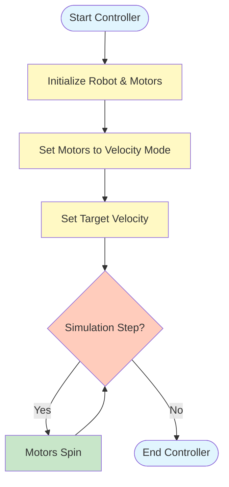
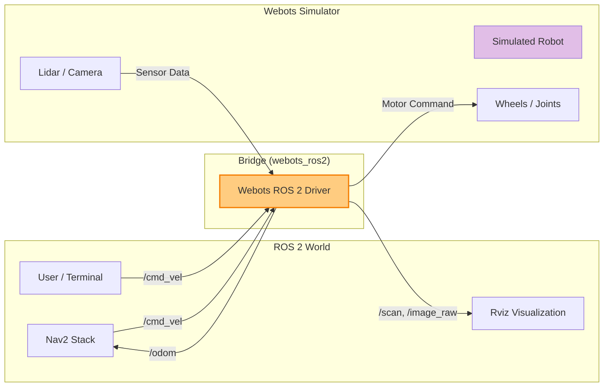

# باب 3: Webots کے ساتھ روبوٹ سمولیشن

> **سیکھنے کے مقاصد**
> - روبوٹ سمولیشن کی اہمیت اور "Sim-to-Real" کے فرق کو سمجھیں۔
> - Linux اور Windows پر **Webots** کو انسٹال اور کنفیگر کریں۔
> - روبوٹ کو حرکت دینے کے لیے ایک سادہ Python کنٹرولر بنائیں۔
> - ROS 2 کے ساتھ Webots کو انٹیگریٹ کریں تاکہ topics کو پبلش اور سبسکرائب کیا جا سکے۔
> - Webots کا Gazebo سے موازنہ کریں اور سمجھیں کہ ہر ایک کو کب استعمال کرنا ہے۔

## 1. روبوٹ سمولیشن کا تعارف

سمولیشن Physical AI کا کھیل کا میدان ہے۔ اس سے پہلے کہ ہم ایک 50 کلو وزنی ہیومنائیڈ روبوٹ کو حقیقی دنیا میں چلنے دیں (جہاں وہ گر سکتا ہے، ٹوٹ سکتا ہے، یا کسی کو چوٹ پہنچا سکتا ہے)، ہم اسے ایک **سمولیٹر** میں چلنا سکھاتے ہیں۔

### سمولیٹ کیوں کریں؟

1.  **حفاظت**: ایک سمولیٹڈ روبوٹ 1,000 بار بغیر کسی قیمت کے کریش ہو سکتا ہے۔ ایک حقیقی روبوٹ کا ایک بار کریش ہونا ہزاروں ڈالرز کا خرچہ کر سکتا ہے۔
2.  **رفتار**: سمولیشن حقیقی وقت سے زیادہ تیزی سے چل سکتے ہیں۔ آپ ایک AI ایجنٹ کو "100 دن" کے تجربے کے لیے صرف چند گھنٹوں میں تربیت دے سکتے ہیں۔
3.  **قابلِ تولید**: آپ ہر بار اپنے کوڈ کی جانچ کرنے کے لیے بالکل وہی منظر نامہ (مثلاً، روبوٹ کے سامنے چلتا ہوا ایک شخص) دوبارہ بنا سکتے ہیں۔

### Sim-to-Real کا فرق

اگرچہ سمولیشن طاقتور ہے، لیکن یہ کامل نہیں ہے۔ سمولیشن میں روبوٹ کے برتاؤ اور حقیقی دنیا کے درمیان فرق کو **Sim-to-Real Gap** کہا جاتا ہے۔
- **فزکس**: رگڑ، ہوا کی مزاحمت، اور موٹر ڈائنامکس کو بالکل درست ماڈل کرنا مشکل ہے۔
- **سینسرز**: حقیقی کیمروں میں شور، دھندلاہٹ، اور روشنی کی تبدیلیاں ہوتی ہیں جنہیں سمولیشن نظر انداز کر سکتے ہیں۔

> [!NOTE]
> ہمارا مقصد اس فرق کو کم کرنا ہے تاکہ Webots میں کام کرنے والا کوڈ حقیقی روبوٹ پر کم سے کم تبدیلیوں کے ساتھ کام کرے۔

---

## 2. Webots کے ساتھ شروع کرنا

ہم **Webots** کو اپنے بنیادی سمولیٹر کے طور پر استعمال کریں گے۔ یہ اوپن سورس، صارف دوست ہے، اور کئی پہلے سے بنے ہوئے روبوٹس (بشمول NAO اور Boston Dynamics Spot جیسے ہیومنائیڈز) کے ساتھ آتا ہے۔

### انسٹالیشن گائیڈ

#### آپشن A: Linux (Ubuntu 22.04 / 24.04)

Ubuntu پر Webots کو انسٹال کرنے کا سب سے آسان طریقہ آفیشل Debian پیکیج استعمال کرنا ہے۔

1.  **ڈیب فائل ڈاؤن لوڈ کریں**:
    [Webots Releases Page](https://github.com/cyberbotics/webots/releases) پر جائیں اور تازہ ترین ورژن ڈاؤن لوڈ کریں (مثلاً، `webots_2023b_amd64.deb`)۔

2.  **ٹرمینل کے ذریعے انسٹال کریں**:
    ```bash
    cd ~/Downloads
    sudo apt install ./webots_*.deb
    ```

3.  **انسٹالیشن کی تصدیق کریں**:
    اپنے ٹرمینل میں `webots` ٹائپ کریں۔ سمولیٹر شروع ہو جانا چاہیے۔

#### آپشن B: Windows 10 / 11

1.  **انسٹالر ڈاؤن لوڈ کریں**:
    [Webots Releases Page](https://github.com/cyberbotics/webots/releases) پر جائیں اور `.exe` انسٹالر ڈاؤن لوڈ کریں (مثلاً، `webots-2023b_setup.exe`)۔

2.  **انسٹالر چلائیں**:
    اسکرین پر دی گئی ہدایات پر عمل کریں۔ اگر پوچھا جائے تو "Add Webots to PATH" کو چیک کرنے کی تجویز دی جاتی ہے۔

3.  **تصدیق کریں**:
    اسٹارٹ مینو کھولیں، "Webots" تلاش کریں، اور اسے لانچ کریں۔

> [!IMPORTANT]
> **سسٹم کی ضروریات**: Webots کو ایک مناسب GPU (NVIDIA تجویز کردہ) اور کم از کم 8GB RAM کی ضرورت ہے۔ اگر Webots سست چلتا ہے، تو `Tools > Preferences > OpenGL` میں گرافیکل کوالٹی کم کرنے کی کوشش کریں۔

---

## 3. اپنی پہلی ورلڈ چلانا

جب آپ Webots کھولتے ہیں، تو آپ کا استقبال ایک خوش آمدیدی اسکرین سے ہوتا ہے۔ آئیے ایک نئی ورلڈ بنائیں اور اس میں ایک روبوٹ شامل کریں۔

1.  **ایک نئی ورلڈ بنائیں**:
    - **File > New World** پر جائیں۔
    - "Empty World" کو منتخب کریں اور **Next** پر کلک کریں پھر **Finish** کریں۔
    - آپ کو ایک چیکرڈ فلور اور ایک سادہ پس منظر نظر آئے گا۔

2.  **ایک روبوٹ شامل کریں (Pioneer 3-DX)**:
    - اوپر والے ٹول بار پر **Add** بٹن (➕) پر کلک کریں (یا `Ctrl+Shift+A` دبائیں)۔
    - سرچ بار میں، `Pioneer 3-DX` ٹائپ کریں۔
    - `PROTO nodes (Webots Projects) > robots > adepts > pioneer3 > Pioneer3dx (Robot)` پر جائیں۔
    - **Add** پر کلک کریں۔

    > [!TIP]
    > Pioneer 3-DX ایک مشہور دو پہیوں والا موبائل روبوٹ ہے جو سیکھنے کے لیے بہترین ہے۔ اس میں دو ڈرائیو وہیلز اور استحکام کے لیے ایک کاسٹر وہیل ہے۔

3.  **انٹرفیس کو دریافت کریں**:
    - **3D ویوپورٹ**:
        - **بائیں کلک + ڈریگ**: کیمرہ گھمائیں۔
        - **دائیں کلک + ڈریگ**: کیمرہ پین (حرکت) کریں۔
        - **اسکرول وہیل**: زوم ان اور آؤٹ کریں۔
    - **سین ٹری (بائیں پینل)**: یہ آپ کی دنیا میں ہر چیز کی فہرست دکھاتا ہے۔ آپ کو یہاں `Pioneer3dx` درج نظر آنا چاہیے۔
    - **پراپرٹیز (دائیں پینل)**: جب آپ سین ٹری میں روبوٹ پر کلک کرتے ہیں، تو اس کی پراپرٹیز (پوزیشن، گردش، کنٹرولر) یہاں ظاہر ہوتی ہیں۔

---

## 4. ایک سادہ روبوٹ کنٹرولر بنانا

ایک **کنٹرولر** ایک پروگرام (عام طور پر Python یا C++) ہے جو روبوٹ کو بتاتا ہے کہ کیا کرنا ہے۔ آئیے ایک سادہ Python اسکرپٹ لکھتے ہیں تاکہ ہمارے Pioneer 3-DX کو آگے بڑھایا جا سکے۔

### مرحلہ 1: کنٹرولر بنائیں

1.  Webots میں، **Wizards > New Robot Controller** پر جائیں۔
2.  **Next** پر کلک کریں۔
3.  زبان کے طور پر **Python** کو منتخب کریں۔
4.  اس کا نام `my_first_controller` رکھیں۔
5.  **Finish** پر کلک کریں۔ Webots ایک ٹیمپلیٹ کے ساتھ ٹیکسٹ ایڈیٹر کھولے گا۔

### مرحلہ 2: کوڈ لکھیں

Pioneer کے موٹرز کو کنٹرول کرنے کے لیے ٹیمپلیٹ کوڈ کو اس منطق سے بدل دیں:

```python
from controller import Robot

# 1. Initialize the Robot
robot = Robot()

# Get the time step of the current world
timestep = int(robot.getBasicTimeStep())

# 2. Initialize Motors
# The Pioneer 3-DX has motors named 'left wheel' and 'right wheel'
left_motor = robot.getDevice('left wheel')
right_motor = robot.getDevice('right wheel')

# 3. Set Motors to "Velocity Mode"
# By setting position to infinity, we tell the motor to spin forever
left_motor.setPosition(float('inf'))
right_motor.setPosition(float('inf'))

# 4. Set Velocity (Speed)
# Speed is in radians per second (rad/s)
left_motor.setVelocity(2.0)
right_motor.setVelocity(2.0)

# 5. Main Simulation Loop
while robot.step(timestep) != -1:
    # The robot will keep moving forward as long as this loop runs
    pass
```

### کنٹرولر منطق کا تصور کرنا

یہاں یہ بتایا گیا ہے کہ کنٹرولر ایک لوپ میں روبوٹ کے ساتھ کیسے تعامل کرتا ہے:



### مرحلہ 3: کنٹرولر کو روبوٹ سے منسلک کریں

1.  **سین ٹری** میں، اپنے روبوٹ کو تلاش کریں (مثلاً، `Pioneer3dx`)۔
2.  اسے پھیلائیں اور `controller` فیلڈ کو تلاش کریں۔
3.  موجودہ کنٹرولر نام (یا `<generic>`) پر کلک کریں اور فہرست سے `my_first_controller` کو منتخب کریں۔
4.  **ورلڈ کو محفوظ کریں** (File > Save World As...)۔
5.  **ری سیٹ اور چلائیں**: ری سیٹ بٹن (⏪) پر کلک کریں اور پھر پلے بٹن (▶) پر کلک کریں۔

**نتیجہ**: آپ کا روبوٹ آگے بڑھنا چاہیے!

---

## 5. Webots کو ROS 2 کے ساتھ انٹیگریٹ کرنا

اب اصلی طاقت آتی ہے: Webots کو ROS 2 سے جوڑنا۔ یہ ہمیں معیاری ROS ٹولز (جیسے Rviz، Nav2، اور ہمارے اپنے Nodes) کا استعمال کرتے ہوئے سمولیٹڈ روبوٹ کو کنٹرول کرنے کی اجازت دیتا ہے۔

ہم اس کے لیے `webots_ros2` پیکیج استعمال کرتے ہیں۔

### انسٹالیشن

```bash
sudo apt install ros-jazzy-webots-ros2
```

### ROS 2 سے Webots کو لانچ کرنا

Webots کو دستی طور پر کھولنے کے بجائے، ہم ایک ROS 2 لانچ فائل استعمال کرتے ہیں۔ یہ خود بخود Webots اور ضروری Bridge Nodes کو شروع کر دیتی ہے۔

ایک نئی لانچ فائل `webots_launch.py` بنائیں:

```python
import os
from launch import LaunchDescription
from launch.actions import IncludeLaunchDescription
from launch.launch_description_sources import PythonLaunchDescriptionSource
from ament_index_python.packages import get_package_share_directory

def generate_launch_description():
    # Find the webots_ros2_driver package
    webots_ros2_driver_pkg = get_package_share_directory('webots_ros2_driver')

    # Include the standard Webots launch file
    webots_launch = IncludeLaunchDescription(
        PythonLaunchDescriptionSource(
            os.path.join(webots_ros2_driver_pkg, 'launch', 'webots_launch.py')
        ),
        launch_arguments={
            'world': 'path/to/your/my_world.wbt', # Replace with your world path
            'mode': 'realtime',
        }.items()
    )

    return LaunchDescription([
        webots_launch
    ])
```

### ROS 2 Topics کے ذریعے کنٹرول کرنا

`webots_ros2` ڈرائیور ایک Bridge کے طور پر کام کرتا ہے۔ یہ Webots (Sensors) سے ڈیٹا پڑھتا ہے اور اسے ROS 2 پر پبلش کرتا ہے۔ یہ ROS 2 کمانڈز کو بھی سبسکرائب کرتا ہے اور انہیں Webots (Motors) کو بھیجتا ہے۔



ایک بار جب Bridge چل رہا ہو، تو Webots روبوٹ کے موٹرز اور سینسرز کو ROS 2 topics کے طور پر بے نقاب کرتا ہے۔

1.  **Topics کی فہرست بنائیں**:
    ```bash
    ros2 topic list
    ```
    آپ کو `/cmd_vel`، `/scan`، `/odom`، وغیرہ نظر آنے چاہییں۔

2.  **روبوٹ کو حرکت دیں**:
    `/cmd_vel` پر ایک ویلوسیٹی کمانڈ پبلش کریں:
    ```bash
    ros2 topic pub /cmd_vel geometry_msgs/msg/Twist "{linear: {x: 0.5}, angular: {z: 0.0}}"
    ```
    Webots میں روبوٹ کو حرکت کرنی چاہیے!

### ایک ROS 2 کنٹرول Node لکھنا

ٹرمینل استعمال کرنے کے بجائے، آئیے روبوٹ کو دائرے میں چلانے کے لیے ایک Python اسکرپٹ لکھتے ہیں۔

`circle_driver.py` نامی ایک فائل بنائیں:

```python
import rclpy
from rclpy.node import Node
from geometry_msgs.msg import Twist

class CircleDriver(Node):
    def __init__(self):
        super().__init__('circle_driver')
        # Publish to /cmd_vel to control the robot
        self.publisher_ = self.create_publisher(Twist, '/cmd_vel', 10)
        # Timer to publish commands every 0.1 seconds
        self.timer = self.create_timer(0.1, self.timer_callback)
        self.get_logger().info('Circle Driver Started: Driving robot in a circle')

    def timer_callback(self):
        msg = Twist()
        # Linear velocity (forward speed)
        msg.linear.x = 0.5
        # Angular velocity (turning speed)
        msg.angular.z = 0.5
        
        self.publisher_.publish(msg)

def main(args=None):
    rclpy.init(args=args)
    node = CircleDriver()
    try:
        rclpy.spin(node)
    except KeyboardInterrupt:
        pass
    finally:
        # Stop the robot when shutting down
        stop_msg = Twist()
        node.publisher_.publish(stop_msg)
        node.destroy_node()
        rclpy.shutdown()

if __name__ == '__main__':
    main()
```

جب Webots اور Bridge چل رہے ہوں تو اس Node کو چلائیں، اور آپ کا سمولیٹڈ روبوٹ دائروں میں چلنا شروع کر دے گا!

---

## 6. عام مسائل کا ازالہ

### 1. "Webots شروع نہیں ہوتا" یا کریش ہو جاتا ہے
- **وجہ**: اکثر GPU ڈرائیور کے مسائل کی وجہ سے۔
- **حل**: اپنے NVIDIA/AMD ڈرائیورز کو اپ ڈیٹ کریں۔ Linux پر، OpenGL موڈ کو مجبور کرنے کے لیے `webots --stream="enforce-gl"` کے ساتھ لانچ کرنے کی کوشش کریں۔

### 2. "کنٹرولر نہیں ملا"
- **وجہ**: روبوٹ کا `controller` فیلڈ آپ کے اسکرپٹ نام سے مماثل نہیں ہے۔
- **حل**: سین ٹری چیک کریں۔ روبوٹ پر کلک کریں، `controller` فیلڈ تلاش کریں، اور یقینی بنائیں کہ یہ `my_first_controller` (یا `<extern>` اگر ROS 2 استعمال کر رہے ہیں) پر سیٹ ہے۔

### 3. ROS 2 Topics غائب ہیں
- **وجہ**: `webots_ros2_driver` نہیں چل رہا ہے یا سمولیشن رکا ہوا ہے۔
- **حل**: یقینی بنائیں کہ آپ نے Bridge کو صحیح طریقے سے لانچ کیا ہے۔ چیک کریں کہ سمولیشن چل رہا ہے (▶ بٹن)۔ یہ دیکھنے کے لیے `ros2 node list` چلائیں کہ آیا ڈرائیور Node فعال ہے۔

---

## 7. Webots بمقابلہ Gazebo

| خصوصیت | Webots | Gazebo (کلاسیکی / اگنیشن) |
| :--- | :--- | :--- |
| **استعمال میں آسانی** | ⭐⭐⭐⭐⭐ بہت زیادہ۔ آسان انسٹالر، سادہ GUI۔ | ⭐⭐⭐ متوسط۔ زیادہ سیٹ اپ کی ضرورت ہے۔ |
| **بلٹ ان روبوٹس** | بہت بڑی لائبریری (NAO، Spot، DJI ڈرونز)۔ | کم بلٹ ان، کمیونٹی پیکیجز پر انحصار کرتا ہے۔ |
| **فزکس** | ODE (تیز، مستحکم)۔ | ODE، Bullet، Dart، Simbody (لچکدار)۔ |
| **ROS 2 سپورٹ** | اچھا (`webots_ros2`)۔ | بہترین (نیٹو انٹیگریشن)۔ |
| **بہترین کس کے لیے** | مبتدیوں، تعلیم، ہیومنائیڈز کے لیے۔ | تحقیق، کسٹم فزکس، پیچیدہ ماحول کے لیے۔ |

> [!TIP]
> ہم اس کتاب میں **Webots** کا استعمال کرتے ہیں کیونکہ یہ ہمیں سمولیشن کنفیگریشن سے لڑنے کے بجائے *AI اور منطق* پر توجہ مرکوز کرنے دیتا ہے۔

---

## باب کا خلاصہ

- **سمولیشن** محفوظ اور تیز روبوٹ کی ترقی کے لیے اہم ہے۔
- **Webots** بہترین ROS 2 سپورٹ کے ساتھ ایک صارف دوست سمولیٹر ہے۔
- Webots میں ایک **کنٹرولر** روبوٹ کا دماغ ہوتا ہے۔
- **`webots_ros2`** پیکیج فرق کو ختم کرتا ہے، جس سے ROS 2 Nodes سمولیٹڈ روبوٹس کو کنٹرول کر سکتے ہیں۔

## مشق کے سوالات

1.  **صحیح یا غلط**: کیا ایک سمولیشن حقیقی دنیا کی 100% درستگی کے ساتھ مکمل نقل کرتا ہے؟
2.  **کوڈ**: Webots سمولیشن کے قدم کو آگے بڑھانے کے لیے `while` لوپ میں کون سا فنکشن کال کرنا ضروری ہے؟
3.  **ROS 2**: موبائل روبوٹ کو ویلوسیٹی کمانڈز بھیجنے کے لیے عام طور پر کون سا Topic استعمال ہوتا ہے؟

<details>
<summary>جوابات دیکھنے کے لیے کلک کریں</summary>

1.  **غلط**۔ "Sim-to-Real Gap" کا مطلب ہے کہ سمولیشن تخمینہ ہیں۔
2.  `robot.step(timestep)`
3.  `/cmd_vel`

</details>