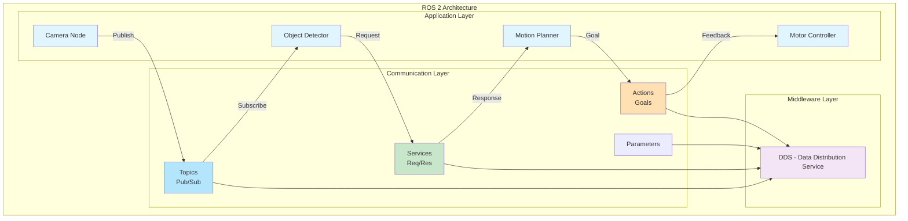
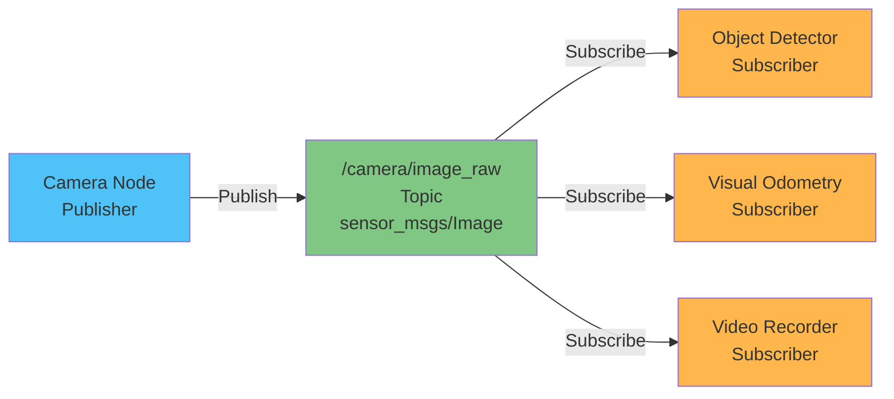
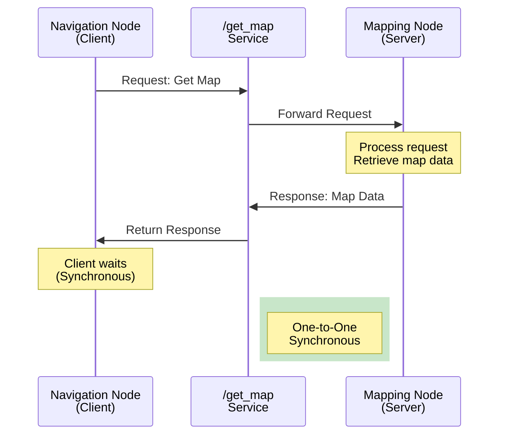
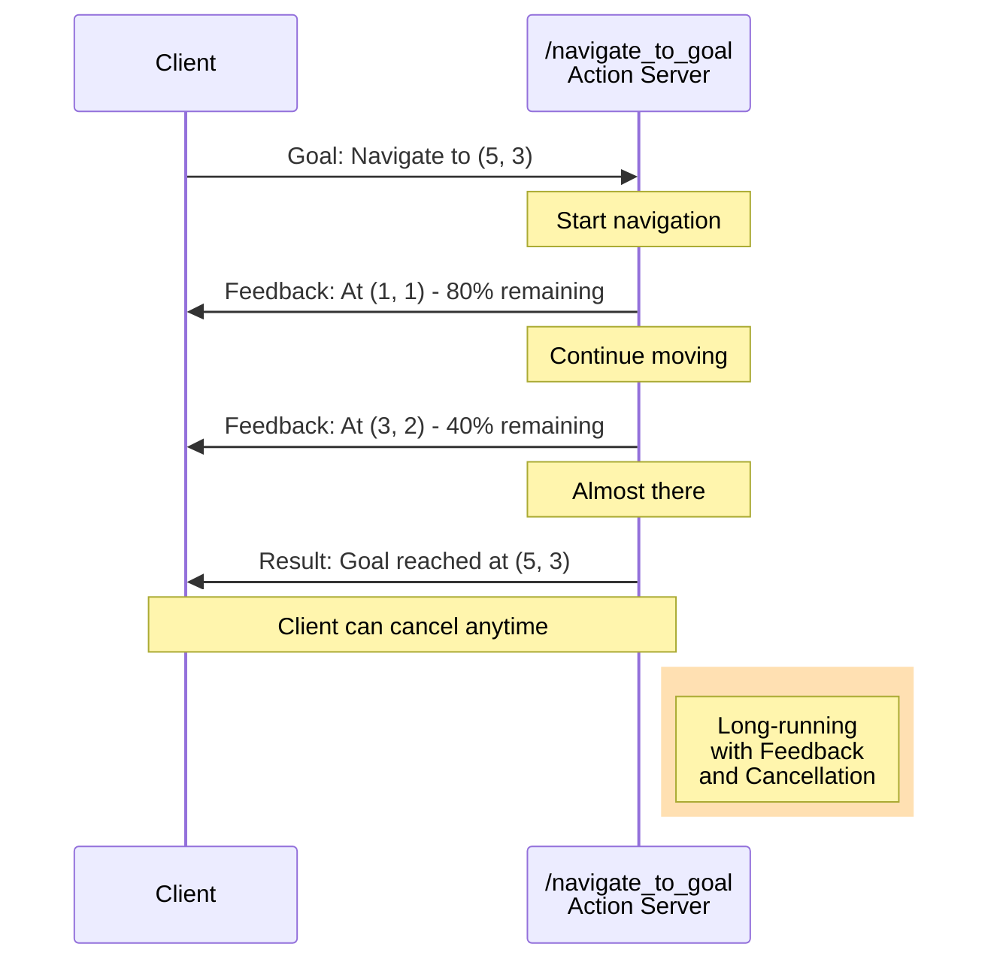
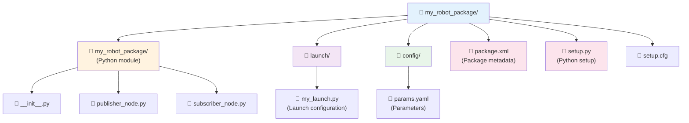
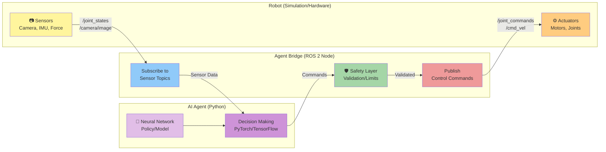

# باب 2: ROS 2 کے بنیادی اصول

## ROS 2 کا تعارف

باب 1 میں، ہم نے Physical AI کی بنیادوں کو دریافت کیا اور سینسرز (sensors) اور ایکچویٹرز (actuators) کے بارے میں جانا جو روبوٹس کو فزیکل دنیا میں محسوس کرنے اور عمل کرنے کے قابل بناتے ہیں۔ لیکن ہم ان تمام اجزاء—کیمروں، LiDAR، IMUs، موٹرز، اور AI algorithms—کو ایک مربوط، فعال روبوٹ میں کیسے مربوط کرتے ہیں؟ یہ وہ جگہ ہے جہاں **ROS 2** (Robot Operating System 2) کام آتا ہے۔

ROS 2 روایتی معنوں میں کوئی آپریٹنگ سسٹم نہیں ہے (جیسے Windows یا Linux)۔ بلکہ، یہ ایک **middleware framework** ہے اور ٹولز، لائبریریوں اور کنونشنز کا ایک مجموعہ ہے جو ڈویلپرز کو روبوٹ ایپلی کیشنز بنانے میں مدد کرتا ہے۔ ROS 2 کو روبوٹ کے "اعصابی نظام" کے طور پر سوچیں—یہ مواصلاتی انفراسٹرکچر فراہم کرتا ہے جو روبوٹ کے مختلف حصوں (سینسرز، ایکچویٹرز، AI algorithms) کو بغیر کسی رکاوٹ کے ایک دوسرے سے بات چیت کرنے کی اجازت دیتا ہے۔

### ROS 2 کیوں؟

ایک روبوٹ کو شروع سے بنانا بہت سے پیچیدہ مسائل کو حل کرنے پر مشتمل ہے:
- مختلف سافٹ ویئر اجزاء کیسے بات چیت کرتے ہیں؟
- ہم ریئل ٹائم سینسر ڈیٹا اسٹریمز کو کیسے ہینڈل کرتے ہیں؟
- ہم بیک وقت چلنے والے متعدد عملوں کو کیسے مربوط کرتے ہیں؟
- ہم اپنے کوڈ کو مختلف روبوٹس پر دوبارہ قابل استعمال کیسے بناتے ہیں؟

ROS 2 ان مسائل کے لیے معیاری حل فراہم کرتا ہے، جس سے ڈویلپرز کو اپنے مخصوص ایپلی کیشن پر توجہ مرکوز کرنے کی اجازت ملتی ہے بجائے اس کے کہ پہیہ دوبارہ ایجاد کریں۔ یہ تحقیق اور صنعت دونوں میں بڑے پیمانے پر استعمال ہوتا ہے، تعلیمی لیبز سے لے کر Tesla، NASA، اور Boston Dynamics جیسی کمپنیوں تک۔

### ROS 1 بمقابلہ ROS 2: کیا بدلا؟

اگر آپ نے ROS (جسے اب ROS 1 کہا جاتا ہے) کے بارے میں سنا ہے، تو آپ حیران ہو سکتے ہیں کہ ROS 2 کیوں موجود ہے۔ ROS 1 2007 میں لانچ ہونے پر انقلابی تھا، لیکن اس کی حدود تھیں:

*   **Single Point of Failure**: ROS 1 کو ایک مرکزی "master" node کی ضرورت تھی۔ اگر وہ کریش کر جاتا، تو پورا سسٹم ناکام ہو جاتا۔
*   **No Real-Time Support**: ROS 1 کو ریئل ٹائم ایپلی کیشنز کے لیے ڈیزائن نہیں کیا گیا تھا، جس کی وجہ سے یہ حفاظتی اعتبار سے اہم سسٹمز کے لیے غیر موزوں تھا۔
*   **Limited Security**: ROS 1 میں بلٹ ان سیکیورٹی فیچرز نہیں تھے، جو تجارتی اور فوجی ایپلی کیشنز کے لیے مسئلہ تھے۔
*   **Poor Multi-Robot Support**: متعدد روبوٹس کو مربوط کرنا مشکل تھا۔

**ROS 2** کو شروع سے ان مسائل کو حل کرنے کے لیے دوبارہ ڈیزائن کیا گیا تھا:

*   **Decentralized Architecture**: کسی master node کی ضرورت نہیں؛ nodes خود بخود ایک دوسرے کو دریافت کرتے ہیں۔
*   **Real-Time Capable**: DDS (Data Distribution Service) پر بنایا گیا ہے، جو ریئل ٹائم مواصلات کی حمایت کرتا ہے۔
*   **Security**: بلٹ ان authentication اور encryption۔
*   **Better Multi-Robot Support**: متعدد روبوٹس کے بغیر کسی رکاوٹ کے بات چیت کے لیے مقامی حمایت۔
*   **Cross-Platform**: Linux، Windows، اور macOS پر کام کرتا ہے۔

نئے پروجیکٹس کے لیے، خاص طور پر وہ جو humanoid robots یا تجارتی ایپلی کیشنز سے متعلق ہیں، **ROS 2 تجویز کردہ انتخاب ہے**۔

### روبوٹک اعصابی نظام کی تشبیہ

ایک humanoid robot کو انسانی جسم کی طرح تصور کریں:
- **Sensors** حسی اعضاء کی طرح ہیں (آنکھیں، کان، لمس کے رسیپٹرز)
- **Actuators** پٹھوں کی طرح ہیں
- **AI algorithms** دماغ کی طرح ہیں جو فیصلے کرتے ہیں
- **ROS 2** اعصابی نظام کی طرح ہے، جو ان تمام حصوں کے درمیان سگنل لے کر جاتا ہے

جس طرح آپ کا اعصابی نظام آپ کے دماغ کو حسی معلومات حاصل کرنے اور موٹر کمانڈز بھیجنے کی اجازت دیتا ہے، اسی طرح ROS 2 مختلف سافٹ ویئر اجزاء کو ڈیٹا کا تبادلہ کرنے اور اعمال کو مربوط کرنے کی اجازت دیتا ہے۔

## ROS 2 کی ساخت

ROS 2 کی ساخت کو سمجھنا روبوٹ ایپلی کیشنز بنانے کے لیے ضروری ہے۔ بنیادی تصورات ہیں: **nodes**، **topics**، **services**، **actions**، اور **parameters**۔




### Nodes: بنیادی اجزاء

ایک **node** ایک واحد عمل ہے جو ایک مخصوص حساب انجام دیتا ہے۔ ایک روبوٹ سسٹم میں، آپ کے پاس ہو سکتا ہے:
- ایک node جو کیمرے کا ڈیٹا پڑھتا ہے
- ایک node جو اشیاء کا پتہ لگانے کے لیے تصاویر پر کارروائی کرتا ہے
- ایک node جو نیویگیٹ کرنے کے لیے ایک راستہ بناتا ہے
- ایک node جو موٹرز کو کمانڈز بھیجتا ہے

ہر node خود مختار ہے اور دوسرے nodes کو متاثر کیے بغیر (زیادہ تر معاملات میں) شروع، بند یا دوبارہ شروع کیا جا سکتا ہے۔ یہ ماڈیولرٹی debugging کو آسان بناتی ہے اور آپ کو انفرادی اجزاء کو تبدیل یا اپ گریڈ کرنے کی اجازت دیتی ہے۔

**مثال**: ایک humanoid robot میں، آپ کے پاس الگ الگ nodes ہو سکتے ہیں:
- `camera_driver` - کیمروں سے تصاویر لیتا ہے
- `object_detector` - لوگوں اور اشیاء کا پتہ لگاتا ہے
- `balance_controller` - روبوٹ کا توازن برقرار رکھتا ہے
- `motion_planner` - چلنے کے راستے کا منصوبہ بناتا ہے
- `motor_controller` - ایکچویٹرز کو کمانڈز بھیجتا ہے

### Topics: Asynchronous Communication

**Topics** asynchronous، many-to-many communication کے لیے نامزد چینلز ہیں۔ nodes ایک topic پر messages کو **publish** (بھیج) کر سکتے ہیں، اور دوسرے nodes اس topic سے messages کو **subscribe** (حاصل) کر سکتے ہیں۔

**کلیدی خصوصیات**:
*   **Asynchronous**: پبلشرز سبسکرائبرز کے پیغامات وصول کرنے کا انتظار نہیں کرتے
*   **Decoupled**: پبلشرز اور سبسکرائبرز کو ایک دوسرے کے بارے میں جاننے کی ضرورت نہیں ہے
*   **Many-to-Many**: متعدد پبلشرز اور سبسکرائبرز ایک ہی topic استعمال کر سکتے ہیں
*   **Typed**: ہر topic کی ایک مخصوص message type ہوتی ہے (مثلاً، `sensor_msgs/Image`، `geometry_msgs/Twist`)

**مثال**: ایک کیمرہ node `/camera/image_raw` topic پر تصاویر publish کرتا ہے۔ متعدد nodes اس topic کو subscribe کر سکتے ہیں—ایک object detection کے لیے، دوسرا visual odometry کے لیے، اور تیسرا ویڈیو ریکارڈ کرنے کے لیے۔



**استعمال کے معاملات**:
- سینسر ڈیٹا کو سٹریم کرنا (کیمرہ کی تصاویر، LiDAR سکینز، IMU ریڈنگز)
- روبوٹ کی حالت نشر کرنا (پوزیشن، رفتار، بیٹری لیول)
- کنٹرول کمانڈز بھیجنا (موٹر کی رفتار، جوائنٹ کی پوزیشنز)

### Services: Request-Response Communication

جبکہ topics مسلسل ڈیٹا اسٹریمز کے لیے بہترین ہیں، کبھی کبھی آپ کو **request-response** تعامل کی ضرورت ہوتی ہے۔ یہ وہ جگہ ہے جہاں **services** کام آتے ہیں۔

ایک **service** ایک node (کلائنٹ) کو دوسرے node (سرور) کو ایک درخواست بھیجنے اور جواب کا انتظار کرنے کی اجازت دیتا ہے۔ یہ synchronous communication ہے—کلائنٹ اس وقت تک بلاک رہتا ہے جب تک اسے جواب نہ ملے یا time out نہ ہو۔

**کلیدی خصوصیات**:
*   **Synchronous**: کلائنٹ جواب کا انتظار کرتا ہے
*   **One-to-One**: ہر درخواست ایک سرور پر جاتی ہے
*   **Typed**: services میں request اور response message types ہوتے ہیں

**مثال**: ایک navigation node ایک mapping node سے موجودہ map کی درخواست کرنے کے لیے ایک `/get_map` service کو کال کر سکتا ہے۔



**استعمال کے معاملات**:
- کنفیگریشن یا حالت کی معلومات کی درخواست کرنا
- ایک بار کے اعمال کو متحرک کرنا (مثلاً، "ابھی ایک تصویر لیں")
- صلاحیتوں کا استفسار (مثلاً، "کون سے سینسرز دستیاب ہیں؟")

### Actions: طویل المدتی اہداف

**Actions** ایسے کاموں کے لیے ڈیزائن کیے گئے ہیں جن کو مکمل ہونے میں وقت لگتا ہے اور انہیں مانیٹر یا منسوخ کرنے کی ضرورت پڑ سکتی ہے۔ وہ services کی طرح ہیں، لیکن تین اہم اضافوں کے ساتھ:
1. **Feedback**: سرور ہدف پر کام کرتے وقت پیشرفت کی اپ ڈیٹس بھیج سکتا ہے
2. **Cancellation**: کلائنٹ عمل کے درمیان ہدف کو منسوخ کر سکتا ہے
3. **Result**: جب ہدف مکمل ہو جاتا ہے تو سرور ایک حتمی نتیجہ بھیجتا ہے

**مثال**: ایک "navigate to position" action کو مکمل ہونے میں کئی سیکنڈ یا منٹ لگ سکتے ہیں۔ ایکشن سرور روبوٹ کے حرکت کرتے وقت feedback (موجودہ پوزیشن، تخمینی باقی وقت) بھیجتا ہے، اور کلائنٹ ضرورت پڑنے پر منسوخ کر سکتا ہے۔



**استعمال کے معاملات**:
- ہدف کی پوزیشن پر نیویگیشن
- کسی شے کو اٹھانا (پکڑنے کی پیشرفت پر feedback کے ساتھ)
- ایک پیچیدہ حرکت کی ترتیب پر عمل درآمد

### Parameters: کنفیگریشن ویلیوز

**Parameters** کنفیگریشن ویلیوز ہیں جنہیں nodes runtime پر پڑھ اور تبدیل کر سکتے ہیں۔ وہ آپ کو کوڈ کو دوبارہ compile کیے بغیر node کے رویے کو تبدیل کرنے کی اجازت دیتے ہیں۔

**مثال**: ایک کیمرہ node میں اس کے لیے parameters ہو سکتے ہیں:
- `frame_rate`: ہر سیکنڈ میں کتنی تصاویر لینی ہیں
- `exposure`: کیمرے کی exposure سیٹنگ
- `resolution`: تصویر کی ریزولوشن

آپ node لانچ کرتے وقت parameters سیٹ کر سکتے ہیں یا node کے چلتے وقت انہیں تبدیل کر سکتے ہیں۔

### Quality of Service (QoS)

ROS 2 اپنی بنیادی مواصلاتی پرت کے طور پر **DDS (Data Distribution Service)** کا استعمال کرتا ہے۔ DDS **Quality of Service (QoS)** سیٹنگز فراہم کرتا ہے جو پیغامات کی ترسیل کو کنٹرول کرتی ہے:

*   **Reliability**: Reliable (یقینی ترسیل) بمقابلہ Best Effort (پیغامات گر سکتے ہیں)
*   **Durability**: Transient Local (نئے سبسکرائبرز کو حالیہ پیغامات ملتے ہیں) بمقابلہ Volatile (صرف نئے پیغامات ملتے ہیں)
*   **History**: آخری N پیغامات رکھیں بمقابلہ تمام پیغامات رکھیں
*   **Deadline**: پیغامات کے درمیان زیادہ سے زیادہ وقت

**یہ کیوں اہم ہے**: موٹر کمانڈز جیسے اہم ڈیٹا کے لیے، آپ قابل اعتماد ترسیل چاہتے ہیں۔ کیمرے کی تصاویر جیسے ہائی فریکوئنسی سینسر ڈیٹا کے لیے، تاخیر سے بچنے کے لیے best effort قابل قبول ہو سکتا ہے۔

**مثال QoS پروفائلز**:
- **Sensor Data**: Best effort، volatile (ہائی فریکوئنسی، فریمز گرنا ٹھیک ہے)
- **Control Commands**: Reliable، volatile (ترسیل ضروری ہے، لیکن صرف تازہ ترین اہم ہے)
- **Map Data**: Reliable، transient local (ترسیل ضروری ہے، نئے سبسکرائبرز کو تازہ ترین نقشہ درکار ہے)

## ROS 2 Packages بنانا

ایک **package** ROS 2 میں تنظیم کی بنیادی اکائی ہے۔ اس میں آپ کا کوڈ، کنفیگریشن فائلز، launch files، اور میٹا ڈیٹا ہوتا ہے۔

### Package کی ساخت

ایک عام Python ROS 2 package کچھ یوں نظر آتا ہے:




### Package بنانا

**مرحلہ 1: package کا ڈھانچہ بنائیں**

```bash
ros2 pkg create --build-type ament_python my_robot_package --dependencies rclpy std_msgs
```

یہ `my_robot_package` نامی ایک package بناتا ہے جس میں Python build type اور `rclpy` (ROS 2 Python کلائنٹ لائبریری) اور `std_msgs` (معیاری message types) پر انحصار ہوتا ہے۔

**مرحلہ 2: ایک سادہ publisher node لکھیں**

`my_robot_package/publisher_node.py` بنائیں:

```python
import rclpy
from rclpy.node import Node
from std_msgs.msg import String

class MinimalPublisher(Node):
    def __init__(self):
        super().__init__('minimal_publisher')
        # Create a publisher on the 'topic' topic with String message type
        self.publisher_ = self.create_publisher(String, 'topic', 10)
        # Create a timer that calls timer_callback every 0.5 seconds
        self.timer = self.create_timer(0.5, self.timer_callback)
        self.i = 0

    def timer_callback(self):
        msg = String()
        msg.data = f'Hello World: {self.i}'
        self.publisher_.publish(msg)
        self.get_logger().info(f'Publishing: "{msg.data}"')
        self.i += 1

def main(args=None):
    rclpy.init(args=args)
    minimal_publisher = MinimalPublisher()
    rclpy.spin(minimal_publisher)
    minimal_publisher.destroy_node()
    rclpy.shutdown()

if __name__ == '__main__':
    main()
```

**مرحلہ 3: ایک سادہ subscriber node لکھیں**

`my_robot_package/subscriber_node.py` بنائیں:

```python
import rclpy
from rclpy.node import Node
from std_msgs.msg import String

class MinimalSubscriber(Node):
    def __init__(self):
        super().__init__('minimal_subscriber')
        # Create a subscription to the 'topic' topic
        self.subscription = self.create_subscription(
            String,
            'topic',
            self.listener_callback,
            10)

    def listener_callback(self, msg):
        self.get_logger().info(f'I heard: "{msg.data}"')

def main(args=None):
    rclpy.init(args=args)
    minimal_subscriber = MinimalSubscriber()
    rclpy.spin(minimal_subscriber)
    minimal_subscriber.destroy_node()
    rclpy.shutdown()

if __name__ == '__main__':
    main()
```

**مرحلہ 4: اپنے nodes کو شامل کرنے کے لیے `setup.py` کو اپ ڈیٹ کریں**

`setup.py` میں، entry points شامل کریں:

```python
entry_points={
    'console_scripts': [
        'publisher = my_robot_package.publisher_node:main',
        'subscriber = my_robot_package.subscriber_node:main',
    ],
},
```

**مرحلہ 5: Build اور run کریں**

```bash
# Build the package
colcon build --packages-select my_robot_package

# Source the workspace
source install/setup.bash

# Run the publisher in one terminal
ros2 run my_robot_package publisher

# Run the subscriber in another terminal
ros2 run my_robot_package subscriber
```

آپ کو publisher پیغامات بھیجتا ہوا اور subscriber انہیں وصول کرتا ہوا نظر آنا چاہیے!

## Launch Files اور Parameters

nodes کو انفرادی طور پر چلانا ٹیسٹنگ کے لیے ٹھیک ہے، لیکن حقیقی روبوٹ سسٹمز میں درجنوں nodes ہوتے ہیں۔ **Launch files** آپ کو ایک ہی کمانڈ سے متعدد nodes شروع کرنے اور انہیں parameters کے ساتھ کنفیگر کرنے کی اجازت دیتے ہیں۔

### Python Launch Files

ROS 2 Python launch files کو سپورٹ کرتا ہے، جو XML سے زیادہ لچکدار ہیں۔

`launch/my_launch.py` بنائیں:

```python
from launch import LaunchDescription
from launch_ros.actions import Node

def generate_launch_description():
    return LaunchDescription([
        Node(
            package='my_robot_package',
            executable='publisher',
            name='my_publisher',
            parameters=[{'publish_frequency': 2.0}]
        ),
        Node(
            package='my_robot_package',
            executable='subscriber',
            name='my_subscriber'
        ),
    ])
```

launch file چلائیں:

```bash
ros2 launch my_robot_package my_launch.py
```

یہ publisher اور subscriber دونوں nodes کو بیک وقت شروع کرتا ہے۔

### Parameters کا استعمال

آئیے publisher کو publish frequency کے لیے ایک parameter استعمال کرنے کے لیے تبدیل کرتے ہیں۔

`publisher_node.py` کو اپ ڈیٹ کریں:

```python
class MinimalPublisher(Node):
    def __init__(self):
        super().__init__('minimal_publisher')
        
        # Declare a parameter with default value
        self.declare_parameter('publish_frequency', 1.0)
        
        # Get the parameter value
        frequency = self.get_parameter('publish_frequency').value
        
        self.publisher_ = self.create_publisher(String, 'topic', 10)
        self.timer = self.create_timer(1.0 / frequency, self.timer_callback)
        self.i = 0
        
        self.get_logger().info(f'Publishing at {frequency} Hz')
```

اب آپ launch file یا کمانڈ لائن سے فریکوئنسی سیٹ کر سکتے ہیں:

```bash
ros2 run my_robot_package publisher --ros-args -p publish_frequency:=5.0
```

### Parameter Files

پیچیدہ کنفیگریشنز کے لیے، YAML parameter files استعمال کریں۔

`config/params.yaml` بنائیں:

```yaml
minimal_publisher:
  ros__parameters:
    publish_frequency: 10.0
    message_prefix: "Robot says"
```

اسے launch file میں لوڈ کریں:

```python
import os
from ament_index_python.packages import get_package_share_directory

config = os.path.join(
    get_package_share_directory('my_robot_package'),
    'config',
    'params.yaml'
)

Node(
    package='my_robot_package',
    executable='publisher',
    parameters=[config]
)
```

## Services اور Request-Response پیٹرنز

آئیے ایک سادہ service بناتے ہیں جو دو نمبروں کو جمع کرتا ہے۔

**مرحلہ 1: ایک service node بنائیں**

`my_robot_package/add_service.py` بنائیں:

```python
import rclpy
from rclpy.node import Node
from example_interfaces.srv import AddTwoInts

class AddService(Node):
    def __init__(self):
        super().__init__('add_service')
        self.srv = self.create_service(
            AddTwoInts,
            'add_two_ints',
            self.add_callback)
        self.get_logger().info('Add service ready')

    def add_callback(self, request, response):
        response.sum = request.a + request.b
        self.get_logger().info(f'Request: {request.a} + {request.b} = {response.sum}')
        return response

def main(args=None):
    rclpy.init(args=args)
    service = AddService()
    rclpy.spin(service)
    rclpy.shutdown()
```

**مرحلہ 2: ایک client node بنائیں**

`my_robot_package/add_client.py` بنائیں:

```python
import rclpy
from rclpy.node import Node
from example_interfaces.srv import AddTwoInts

class AddClient(Node):
    def __init__(self):
        super().__init__('add_client')
        self.client = self.create_client(AddTwoInts, 'add_two_ints')
        
        # Wait for service to be available
        while not self.client.wait_for_service(timeout_sec=1.0):
            self.get_logger().info('Service not available, waiting...')
        
        self.send_request(10, 5)

    def send_request(self, a, b):
        request = AddTwoInts.Request()
        request.a = a
        request.b = b
        
        future = self.client.call_async(request)
        future.add_done_callback(self.response_callback)

    def response_callback(self, future):
        try:
            response = future.result()
            self.get_logger().info(f'Result: {response.sum}')
        except Exception as e:
            self.get_logger().error(f'Service call failed: {e}')

def main(args=None):
    rclpy.init(args=args)
    client = AddClient()
    rclpy.spin(client)
    rclpy.shutdown()
```

**service اور client کو چلائیں**:

```bash
# Terminal 1: Start the service
ros2 run my_robot_package add_service

# Terminal 2: Call the service
ros2 run my_robot_package add_client
```

## Python AI Agents کو ROS 2 سے جوڑنا

اب دلچسپ حصہ: AI agents کو ROS 2 کے ذریعے روبوٹس کو کنٹرول کرنے کے لیے جوڑنا!

### The Agent-ROS Bridge Pattern

ایک **agent bridge** ایک ہلکا پھلکا adapter ہے جو آپ کے AI agent (جو PyTorch، TensorFlow، یا OpenAI APIs استعمال کر سکتا ہے) کو ROS 2 topics اور services سے جوڑتا ہے۔

**ساخت**:



### مثال: ایک Simulated Humanoid کو کنٹرول کرنا

آئیے ایک agent بناتے ہیں جو ایک simulated humanoid robot کو کنٹرول کرتا ہے۔

**مرحلہ 1: agent bridge node بنائیں**

`publisher_node.py`

```python
import rclpy
from rclpy.node import Node
from sensor_msgs.msg import JointState
from std_msgs.msg import Float64MultiArray
import numpy as np

class HumanoidAgentBridge(Node):
    def __init__(self):
        super().__init__('humanoid_agent_bridge')
        
        # Subscribe to joint states (sensor feedback)
        self.joint_sub = self.create_subscription(
            JointState,
            '/joint_states',
            self.joint_state_callback,
            10)
        
        # Publish joint commands (control output)
        self.cmd_pub = self.create_publisher(
            Float64MultiArray,
            '/joint_commands',
            10)
        
        # Store latest joint states
        self.current_joint_positions = None
        self.current_joint_velocities = None
        
        # Create timer for agent decision loop
        self.timer = self.create_timer(0.1, self.agent_decision_loop)
        
        self.get_logger().info('Agent bridge initialized')

    def joint_state_callback(self, msg):
        """Receive sensor feedback from the robot"""
        self.current_joint_positions = np.array(msg.position)
        self.current_joint_velocities = np.array(msg.velocity)

    def agent_decision_loop(self):
        """AI agent makes decisions based on sensor data"""
        if self.current_joint_positions is None:
            return
        
        # Simple example: AI agent decides on joint commands
        # In a real system, this would call your trained model
        commands = self.compute_agent_action(
            self.current_joint_positions,
            self.current_joint_velocities
        )
        
        # Publish commands to robot
        cmd_msg = Float64MultiArray()
        cmd_msg.data = commands.tolist()
        self.cmd_pub.publish(cmd_msg)

    def compute_agent_action(self, positions, velocities):
        """
        AI agent logic goes here
        This is where you'd call your neural network, policy, etc.
        """
        # Example: Simple PD controller (placeholder for real AI)
        target_positions = np.zeros_like(positions)  # Stand still
        kp = 10.0  # Proportional gain
        kd = 1.0   # Derivative gain
        
        commands = kp * (target_positions - positions) - kd * velocities
        
        # Safety: Clip commands to reasonable range
        commands = np.clip(commands, -100.0, 100.0)
        
        return commands

def main(args=None):
    rclpy.init(args=args)
    bridge = HumanoidAgentBridge()
    rclpy.spin(bridge)
    rclpy.shutdown()
```

### OpenAI یا دیگر AI Frameworks کے ساتھ انضمام

آپ کسی بھی Python AI framework کو ROS 2 کے ساتھ مربوط کر سکتے ہیں:

```python
import openai
from rclpy.node import Node

class AIAgentNode(Node):
    def __init__(self):
        super().__init__('ai_agent')
        self.openai_client = openai.OpenAI()
        
        # Subscribe to camera images
        self.image_sub = self.create_subscription(
            Image,
            '/camera/image',
            self.image_callback,
            10)
        
        # Publish navigation commands
        self.cmd_pub = self.create_publisher(
            Twist,
            '/cmd_vel',
            10)

    def image_callback(self, msg):
        # Convert ROS image to format for AI model
        image = self.ros_image_to_numpy(msg)
        
        # Use AI model to decide action
        action = self.get_ai_decision(image)
        
        # Publish command
        self.publish_command(action)

    def get_ai_decision(self, image):
        # Call your AI model (OpenAI, local model, etc.)
        # This is a placeholder
        response = self.openai_client.chat.completions.create(
            model="gpt-4-vision",
            messages=[{
                "role": "user",
                "content": "What should the robot do?"
            }]
        )
        return response.choices[0].message.content
```

### حفاظتی تحفظات

AI agents کو روبوٹس سے جوڑتے وقت، **حفاظت انتہائی اہم ہے**:

1. **Command Limits**: ہمیشہ کمانڈز کو محفوظ حدود میں رکھیں
2. **Watchdog Timers**: اگر کمانڈز آنا بند ہو جائیں تو روبوٹ کو روک دیں
3. **Emergency Stop**: ایک e-stop لاگو کریں جو AI کمانڈز کو اوور رائیڈ کرتا ہے
4. **Validation**: چیک کریں کہ AI آؤٹ پٹس فزیکی طور پر قابل اعتماد ہیں
5. **Simulation First**: حقیقی ہارڈ ویئر سے پہلے simulation میں اچھی طرح ٹیسٹ کریں

```python
def safe_command_filter(self, commands):
    """Apply safety checks to AI-generated commands"""
    # Check for NaN or Inf
    if not np.all(np.isfinite(commands)):
        self.get_logger().error('Invalid command detected!')
        return np.zeros_like(commands)
    
    # Clip to safe ranges
    commands = np.clip(commands, self.min_cmd, self.max_cmd)
    
    # Rate limit (prevent sudden changes)
    if self.last_commands is not None:
        max_delta = 0.1  # Maximum change per timestep
        delta = commands - self.last_commands
        delta = np.clip(delta, -max_delta, max_delta)
        commands = self.last_commands + delta
    
    self.last_commands = commands
    return commands
```

## عام مسائل کو حل کرنا

### مسئلہ 1: "No executable found"

**خرابی**: `Package 'my_package' not found` یا `Executable 'my_node' not found`

**اسباب**:
- Package build نہیں ہوا
- Workspace source نہیں کیا گیا
- Entry point `setup.py` میں شامل نہیں کیا گیا

**حل**:
```bash
# Rebuild the package
colcon build --packages-select my_package

# Source the workspace
source install/setup.bash

# Check if executable is registered
ros2 pkg executables my_package
```

### مسئلہ 2: "No messages received on topic"

**خرابی**: Subscriber کو publisher سے پیغامات موصول نہیں ہوتے

**اسباب**:
- Topic کے نام کی عدم مطابقت
- QoS عدم مطابقت
- Publisher/subscriber نہیں چل رہا

**حل**:
```bash
# List active topics
ros2 topic list

# Check topic info
ros2 topic info /my_topic

# Echo messages on topic
ros2 topic echo /my_topic

# Check QoS settings
ros2 topic info /my_topic --verbose
```

### مسئلہ 3: "Service call failed"

**خرابی**: کلائنٹ service کو کال نہیں کر سکتا

**اسباب**:
- Service نہیں چل رہا
- Service کے نام کی عدم مطابقت
- Timeout بہت کم

**حل**:
```bash
# List active services
ros2 service list

# Check service type
ros2 service type /my_service

# Call service from command line
ros2 service call /my_service example_interfaces/srv/AddTwoInts "{a: 1, b: 2}"
```

### مسئلہ 4: "Parameter not found"

**خرابی**: Node کو parameter نہیں ملتا

**اسباب**:
- Parameter کا اعلان نہیں کیا گیا
- Parameter file لوڈ نہیں کیا گیا
- Parameter کا غلط نام

**حل**:
```bash
# List node parameters
ros2 param list /my_node

# Get parameter value
ros2 param get /my_node my_parameter

# Set parameter
ros2 param set /my_node my_parameter 10.0
```

### مسئلہ 5: "DDS communication blocked"

**خرابی**: مختلف مشینوں پر nodes بات چیت نہیں کر سکتے

**اسباب**:
- Firewall DDS پورٹس کو بلاک کر رہا ہے
- مختلف ROS_DOMAIN_ID
- نیٹ ورک کنفیگریشن کے مسائل

**حل**:
```bash
# Check ROS_DOMAIN_ID (should match across machines)
echo $ROS_DOMAIN_ID

# Set domain ID
export ROS_DOMAIN_ID=42

# Check firewall (Linux)
sudo ufw status

# Allow DDS ports (7400-7500 typically)
sudo ufw allow 7400:7500/udp
```

## باب کا خلاصہ

اس باب میں، ہم نے **ROS 2** کو middleware framework کے طور پر متعارف کرایا جو جدید روبوٹس کے "اعصابی نظام" کے طور پر کام کرتا ہے۔ ہم نے روبوٹ ایپلی کیشنز بنانے کے لیے درکار بنیادی تصورات اور عملی مہارتوں کا احاطہ کیا۔

**ROS 2 کا جائزہ**: ROS 2 ایک middleware framework ہے جو روبوٹ ایپلی کیشنز بنانے کے لیے مواصلاتی انفراسٹرکچر، ٹولز، اور لائبریریاں فراہم کرتا ہے۔ یہ ROS 1 کی حدود کو ایک decentralized architecture، ریئل ٹائم سپورٹ، بلٹ ان سیکیورٹی، اور بہتر multi-robot صلاحیتوں کے ساتھ حل کرتا ہے۔

**بنیادی تصورات**:
*   **Nodes**: آزاد عمل جو مخصوص حساب انجام دیتے ہیں
*   **Topics**: asynchronous، many-to-many مواصلاتی چینلز ڈیٹا کو سٹریم کرنے کے لیے
*   **Services**: synchronous request-response تعاملات ایک بار کے سوالات کے لیے
*   **Actions**: طویل المدتی اہداف feedback اور cancellation سپورٹ کے ساتھ
*   **Parameters**: node کے رویے کے لیے runtime کنفیگریشن ویلیوز
*   **QoS**: Quality of Service کی سیٹنگز جو message delivery کی ضمانتوں کو کنٹرول کرتی ہیں

**عملی مہارتیں**:
*   Python کے ساتھ ROS 2 packages بنانا
*   publisher اور subscriber nodes لکھنا
*   service servers اور clients بنانا
*   متعدد nodes کو شروع کرنے کے لیے launch files کا استعمال کرنا
*   parameters کے ساتھ nodes کو کنفیگر کرنا
*   روبوٹ کنٹرول کے لیے AI agents کو ROS 2 سے جوڑنا

**حفاظتی تحفظات**: AI agents کو روبوٹس سے جوڑتے وقت، ہمیشہ کمانڈ کی حدود، watchdog timers، ایمرجنسی اسٹاپس، validation checks کو لاگو کریں، اور حقیقی ہارڈ ویئر پر تعینات کرنے سے پہلے simulation میں اچھی طرح ٹیسٹ کریں۔

## اہم نکات

1.  **ROS 2 middleware ہے، OS نہیں**—یہ روبوٹ ایپلی کیشنز بنانے کے لیے مواصلاتی انفراسٹرکچر اور ٹولز فراہم کرتا ہے۔

2.  **Nodes ماڈیولر ہیں**—ہر node ایک مخصوص کام انجام دیتا ہے، جس سے سسٹمز کو debug اور برقرار رکھنا آسان ہوتا ہے۔

3.  **Topics ڈیٹا streaming کو فعال کرتے ہیں**—مسلسل سینسر ڈیٹا اور کنٹرول کمانڈز کے لیے topics استعمال کریں۔

4.  **Services request-response کو فعال کرتے ہیں**—ایک بار کے سوالات اور کنفیگریشن کے لیے services استعمال کریں۔

5.  **Parameters nodes کو configurable بناتے ہیں**—ویلیوز کو hardcode کرنے سے گریز کریں؛ لچک کے لیے parameters استعمال کریں۔

6.  **QoS سیٹنگز اہم ہیں**—ہر مواصلاتی چینل کے لیے مناسب reliability اور durability کا انتخاب کریں۔

7.  **AI agents آسانی سے ضم ہو جاتے ہیں**—ROS 2 کا Python سپورٹ AI frameworks کو جوڑنا آسان بناتا ہے۔

8.  **حفاظت سب سے اہم ہے**—ہمیشہ AI آؤٹ پٹس کی توثیق کریں اور حفاظتی چیک کی کئی تہوں کو لاگو کریں۔

## مشقی سوالات

### متعدد انتخابی سوالات

1.  **ROS 2 کیا ہے؟**
    -   a) روبوٹس کے لیے ایک Linux پر مبنی آپریٹنگ سسٹم
    -   b) روبوٹ مواصلات کے لیے ایک middleware framework
    -   c) روبوٹکس کے لیے ایک پروگرامنگ زبان
    -   d) ایک روبوٹ simulation ماحول

    <details>
    <summary>جواب</summary>
    b) روبوٹ مواصلات کے لیے ایک middleware framework
    </details>

2.  **کیمرہ کی تصاویر کو سٹریم کرنے کے لیے آپ کو کون سا مواصلاتی پیٹرن استعمال کرنا چاہیے؟**
    -   a) Service
    -   b) Action
    -   c) Topic
    -   d) Parameter

    <details>
    <summary>جواب</summary>
    c) Topic (asynchronous، many-to-many، مسلسل ڈیٹا اسٹریمز کے لیے موزوں)
    </details>

3.  **ROS 2 پر ROS 1 کا بنیادی فائدہ کیا ہے؟**
    -   a) سیکھنا آسان
    -   b) Decentralized architecture (کسی master node کی ضرورت نہیں)
    -   c) بہتر گرافکس
    -   d) چھوٹی فائل کا سائز

    <details>
    <summary>جواب</summary>
    b) Decentralized architecture (کسی master node کی ضرورت نہیں)
    </details>

4.  **اہم موٹر کمانڈز کے لیے کون سی QoS سیٹنگ سب سے زیادہ موزوں ہے؟**
    -   a) Best effort، volatile
    -   b) Reliable، volatile
    -   c) Best effort، transient local
    -   d) Reliable، transient local

    <details>
    <summary>جواب</summary>
    b) Reliable، volatile (ترسیل ضروری ہے، لیکن صرف تازہ ترین اہم ہے)
    </details>

5.  **launch file کا مقصد کیا ہے؟**
    -   a) ROS 2 packages کو compile کرنا
    -   b) کنفیگریشن کے ساتھ متعدد nodes شروع کرنا
    -   c) node کے کریشز کو debug کرنا
    -   d) روبوٹ ماڈلز کو visualize کرنا

    <details>
    <summary>جواب</summary>
    b) کنفیگریشن کے ساتھ متعدد nodes شروع کرنا
    </details>

6.  **agent bridge پیٹرن میں، bridge کا کردار کیا ہے؟**
    -   a) AI ماڈل کو تربیت دینا
    -   b) روبوٹ کو simulate کرنا
    -   c) AI agent کو ROS 2 topics/services سے جوڑنا
    -   d) visualization فراہم کرنا

    <details>
    <summary>جواب</summary>
    c) AI agent کو ROS 2 topics/services سے جوڑنا
    </details>

### مختصر جوابات کے سوالات

1.  **ROS 2 میں topics اور services کے درمیان فرق کی وضاحت کریں؟**

    <details>
    <summary>نمونہ جواب</summary>
    Topics asynchronous، many-to-many مواصلاتی چینلز ہیں جو مسلسل ڈیٹا اسٹریمز (جیسے سینسر ڈیٹا) کے لیے استعمال ہوتے ہیں۔ پبلشرز سبسکرائبرز کا انتظار کیے بغیر پیغامات بھیجتے ہیں، اور متعدد nodes ایک ہی topic پر publish یا subscribe کر سکتے ہیں۔ Services synchronous، one-to-one request-response تعاملات ہیں جو ایک بار کے سوالات یا اعمال کے لیے استعمال ہوتے ہیں۔ ایک کلائنٹ ایک درخواست بھیجتا ہے اور سرور سے جواب کا انتظار کرتا ہے۔ Topics streaming ڈیٹا کے لیے بہتر ہیں، جبکہ services کبھی کبھار سوالات یا کمانڈز کے لیے بہتر ہیں جن کو تصدیق کی ضرورت ہوتی ہے۔
    </details>

2.  **ROS 2 nodes میں ویلیوز کو hardcode کرنے کے بجائے parameters استعمال کرنا کیوں ضروری ہے؟**

    <details>
    <summary>نمونہ جواب</summary>
    Parameters کوڈ کو دوبارہ compile کیے بغیر nodes کو configurable بناتے ہیں۔ یہ آپ کو اجازت دیتا ہے: (1) مختلف روبوٹس یا ماحول کے لیے رویے کو ایڈجسٹ کرنا، (2) runtime پر کارکردگی کو ایڈجسٹ کرنا (جیسے کنٹرول گینز یا فریکوئنسیز)، (3) launch files کے ذریعے مختلف کنفیگریشنز کے ساتھ ایک ہی node کو دوبارہ استعمال کرنا، اور (4) دوبارہ build کیے بغیر debugging کے دوران سیٹنگز کو تبدیل کرنا۔ Hardcoded ویلیوز لچک کو کم کرتی ہیں اور دیکھ بھال کو مشکل بناتی ہیں۔
    </details>

3.  **جب آپ ایک AI agent کو حقیقی روبوٹ سے جوڑتے ہیں تو آپ کو کون سے حفاظتی اقدامات لاگو کرنے چاہئیں؟**

    <details>
    <summary>نمونہ جواب</summary>
    اہم حفاظتی اقدامات میں شامل ہیں: (1) کمانڈ کی حدود - تمام آؤٹ پٹس کو محفوظ حدود میں رکھیں، (2) توثیق - NaN/Inf اور فزیکی طور پر ناقابل اعتبار کمانڈز کو چیک کریں، (3) ریٹ لمیٹنگ - کمانڈز میں اچانک بڑی تبدیلیوں کو روکیں، (4) Watchdog timers - اگر کمانڈز آنا بند ہو جائیں تو روبوٹ کو روک دیں، (5) ایمرجنسی اسٹاپ - ہارڈ ویئر e-stop جو تمام AI کمانڈز کو اوور رائیڈ کرتا ہے، (6) Simulation ٹیسٹنگ - حقیقی ہارڈ ویئر سے پہلے simulation میں اچھی طرح ٹیسٹ کریں، اور (7) نگرانی - واقعے کے بعد کے تجزیے کے لیے تمام کمانڈز اور سینسر ڈیٹا کو لاگ کریں۔
    </details>

4.  **ایک ایسے منظر نامے کی وضاحت کریں جہاں آپ service کے بجائے action استعمال کریں گے؟**

    <details>
    <summary>نمونہ جواب</summary>
    Action کا استعمال ایسے طویل المدتی کاموں کے لیے کریں جن کو feedback اور cancellation کی ضرورت ہو۔ مثال: "Navigate to position (x, y)"۔ اس میں 30 سیکنڈ لگ سکتے ہیں، جس کے دوران آپ چاہتے ہیں: (1) Feedback - موجودہ پوزیشن اور تخمینی باقی وقت، (2) Cancellation - ہدف کے غلط ہونے پر روکنے کی صلاحیت، (3) Result - جب ہدف تک پہنچ جائے تو حتمی تصدیق۔ ایک service feedback کے بغیر پوری مدت کے لیے بلاک رہے گی، جو اسے غیر موزوں بناتی ہے۔ Actions طویل المدتی کارروائیوں کے لیے ضروری feedback لوپ اور کنٹرول فراہم کرتے ہیں۔
    </details>

5.  **ROS 2 کا decentralized architecture ROS 1 کے مقابلے میں وشوسنییتا کو کیسے بہتر بناتا ہے؟**

    <details>
    <summary>نمونہ جواب</summary>
    ROS 1 کو node discovery اور مواصلاتی سیٹ اپ کے لیے ایک مرکزی "master" node کی ضرورت تھی۔ اگر master کریش کر جاتا، تو پورا سسٹم ناکام ہو جاتا۔ ROS 2 decentralized peer-to-peer discovery کے لیے DDS (Data Distribution Service) کا استعمال کرتا ہے—nodes ایک مرکزی کوآرڈینیٹر کے بغیر خود بخود ایک دوسرے کو تلاش کر لیتے ہیں۔ یہ single point of failure کو ختم کرتا ہے۔ اگر ایک node کریش ہو جاتا ہے، تو دوسرے کام کرتے رہتے ہیں۔ یہ خودمختار گاڑیوں یا humanoid robots جیسی حفاظتی اعتبار سے اہم ایپلی کیشنز کے لیے اہم ہے جہاں سسٹم کی وسیع ناکامی ناقابل قبول ہے۔
    </details>

### عملی مشقیں

**مشق 1: ایک ٹمپریچر مانیٹرنگ سسٹم بنائیں**

تین nodes کے ساتھ ایک ROS 2 package بنائیں:
1.  **Sensor Node**: ہر سیکنڈ میں `/temperature` topic پر بے ترتیب درجہ حرارت کی ریڈنگز (18-30°C) publish کرتا ہے
2.  **Monitor Node**: `/temperature` کو subscribe کرتا ہے اور اگر درجہ حرارت > 25°C ہو تو ایک وارننگ log کرتا ہے
3.  **Logger Node**: `/temperature` کو subscribe کرتا ہے اور تمام ریڈنگز کو ایک فائل میں محفوظ کرتا ہے

**تقاضے**:
- تمام تینوں nodes کو شروع کرنے کے لیے ایک launch file استعمال کریں
- publish frequency کے لیے sensor node میں ایک parameter شامل کریں
- درجہ حرارت کی حد کے لیے monitor node میں ایک parameter شامل کریں

**بونس**: logger node میں ایک service شامل کریں جو درخواست پر اوسط درجہ حرارت واپس کرتا ہے۔

<details>
<summary>نمونہ حل کا خاکہ</summary>

**sensor_node.py**:
```python
import rclpy
from rclpy.node import Node
from std_msgs.msg import Float32
import random

class TemperatureSensor(Node):
    def __init__(self):
        super().__init__('temperature_sensor')
        self.declare_parameter('frequency', 1.0)
        freq = self.get_parameter('frequency').value
        
        self.pub = self.create_publisher(Float32, 'temperature', 10)
        self.timer = self.create_timer(1.0/freq, self.publish_temp)
    
    def publish_temp(self):
        temp = random.uniform(18.0, 30.0)
        msg = Float32()
        msg.data = temp
        self.pub.publish(msg)
        self.get_logger().info(f'Temperature: {temp:.1f}°C')
```

**monitor_node.py**: `/temperature` کو Subscribe کریں، threshold parameter کے خلاف چیک کریں، وارننگز log کریں۔

**logger_node.py**: `/temperature` کو Subscribe کریں، فائل میں شامل کریں، اوسط کے لیے service لاگو کریں۔

**launch/temp_system.launch.py**: parameters کے ساتھ تمام تینوں nodes کو شروع کریں۔
</details>

**مشق 2: سادہ نیویگیشن کے لیے AI Agent**

ایک agent bridge بنائیں جو ایک simulated robot کو کنٹرول کرتا ہے (آپ ایک سادہ 2D turtle simulator یا کوئی بھی دستیاب روبوٹ simulation استعمال کر سکتے ہیں):

1.  **Agent Bridge Node**: 
    -   robot پوزیشن/odometry کو Subscribe کریں
    -   ایک سادہ AI پالیسی لاگو کریں (مثلاً، ایک ہدف کی پوزیشن کی طرف بڑھیں)
    -   velocity کمانڈز publish کریں
    -   حفاظت لاگو کریں: اگر رکاوٹوں کے بہت قریب ہو تو رک جائیں

2.  **ٹیسٹ**:
    -   ایک ہدف کی پوزیشن سیٹ کریں
    -   تصدیق کریں کہ روبوٹ ہدف کی طرف بڑھتا ہے
    -   تصدیق کریں کہ روبوٹ رکاوٹوں کے قریب رک جاتا ہے

**بونس**: runtime پر ایک نئی ہدف کی پوزیشن سیٹ کرنے کے لیے ایک service شامل کریں۔

<details>
<summary>نمونہ حل کا خاکہ</summary>

```python
import rclpy
from rclpy.node import Node
from geometry_msgs.msg import Twist
from nav_msgs.msg import Odometry
import numpy as np

class NavigationAgent(Node):
    def __init__(self):
        super().__init__('navigation_agent')
        
        # Goal position
        self.goal_x = 5.0
        self.goal_y = 5.0
        
        # Current position
        self.current_x = 0.0
        self.current_y = 0.0
        
        # Subscribe to odometry
        self.odom_sub = self.create_subscription(
            Odometry, '/odom', self.odom_callback, 10)
        
        # Publish velocity commands
        self.cmd_pub = self.create_publisher(Twist, '/cmd_vel', 10)
        
        # Control loop
        self.timer = self.create_timer(0.1, self.control_loop)
    
    def odom_callback(self, msg):
        self.current_x = msg.pose.pose.position.x
        self.current_y = msg.pose.pose.position.y
    
    def control_loop(self):
        # Simple proportional controller
        dx = self.goal_x - self.current_x
        dy = self.goal_y - self.current_y
        distance = np.sqrt(dx**2 + dy**2)
        
        cmd = Twist()
        
        if distance > 0.1:  # Not at goal
            # Move toward goal
            cmd.linear.x = min(0.5, distance * 0.5)  # Proportional speed
            cmd.angular.z = np.arctan2(dy, dx) * 0.5  # Turn toward goal
        else:
            # At goal, stop
            cmd.linear.x = 0.0
            cmd.angular.z = 0.0
            self.get_logger().info('Goal reached!')
        
        self.cmd_pub.publish(cmd)
```
</details>

## مزید مطالعہ

ROS 2 کے بارے میں اپنی سمجھ کو گہرا کرنے کے لیے:

-   **سرکاری ROS 2 دستاویزات**: [docs.ros.org](https://docs.ros.org) - جامع ٹیوٹوریلز اور API reference
-   **"Programming Robots with ROS" از Morgan Quigley et al.**: ROS ڈویلپمنٹ کے لیے عملی گائیڈ
-   **ROS 2 ڈیزائن دستاویزات**: [design.ros2.org](https://design.ros2.org) - Architectural فیصلے اور ان کی وجوہات
-   **DDS Specification**: بنیادی مواصلاتی پرت کو سمجھنا
-   **ROS Discourse**: [discourse.ros.org](https://discourse.ros.org) - سوالات اور مباحثوں کے لیے کمیونٹی فورم

**تجویز کردہ ROS 2 ورژن**: اس کتاب کے لیے، ہم **ROS 2 Humble Hawksbill** (LTS release، 2027 تک سپورٹ شدہ) یا تازہ ترین خصوصیات کے لیے **ROS 2 Iron Irwini** کی سفارش کرتے ہیں۔

## اگلے اقدامات

اگلے باب میں، ہم **Gazebo کے ساتھ روبوٹ simulation** کو دریافت کریں گے، جہاں آپ ROS 2 کے اپنے علم کو حقیقت پسندانہ 3D ماحول میں ورچوئل humanoid robots کو کنٹرول کرنے کے لیے استعمال کریں گے۔ آپ سیکھیں گے کہ کیسے:
-   Gazebo simulation ماحول ترتیب دیں
-   humanoid robot ماڈلز کو امپورٹ اور کنفیگر کریں
-   اپنے ROS 2 nodes کو simulated sensors اور actuators سے جوڑیں
-   حقیقی ہارڈ ویئر پر تعینات کرنے سے پہلے AI agents کو محفوظ طریقے سے ٹیسٹ کریں

اپنے ROS 2 کی مہارتوں کو عملی جامہ پہنانے کے لیے تیار ہیں؟ آئیے [باب 3: Gazebo کے ساتھ روبوٹ Simulation](./chapter3.md) کی طرف بڑھتے ہیں!