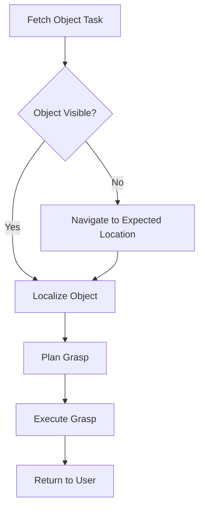

# Cognitive Planning for Humanoid Robots

Cognitive planning enables humanoid robots to perform complex, multi-step tasks by reasoning about their environment and goals. This involves high-level decision making, task scheduling, and adaptation to dynamic environments.

## Understanding Cognitive Planning

Cognitive planning in robotics refers to the ability of a robot to:
- Break down complex tasks into executable subtasks
- Reason about the environment and possible actions
- Adapt plans based on feedback and unexpected situations
- Optimize task execution based on various constraints

## Planning Architecture

The cognitive planning system consists of several layers:

1. **Task Planner**: Determines the high-level sequence of activities
2. **Motion Planner**: Plans specific movements and actions
3. **Execution Engine**: Executes the planned actions
4. **Feedback System**: Monitors execution and adjusts plans

## Implementation Approaches

### Hierarchical Task Networks (HTN)

HTN planning decomposes high-level tasks into smaller subtasks. For example, a "fetch object" task might decompose into:
1. Navigate to object location
2. Identify and localize object
3. Plan grasping motion
4. Execute grasp
5. Navigate back to user

### Behavior Trees

Behavior trees provide a modular approach to complex robot behaviors:



### PDDL-Based Planning

Planning Domain Definition Language (PDDL) provides standardized representation for planning problems:

```pddl
(define (domain humanoid-tasks)
  (:requirements :strips :typing :equality)
  (:types robot location object)
  (:predicates 
    (at ?r - robot ?loc - location)
    (carrying ?r - robot ?obj - object)
    (at-location ?obj - object ?loc - location)
  )
  (:action navigate
    :parameters (?r - robot ?from ?to - location)
    :precondition (and (at ?r ?from) (not (= ?from ?to)))
    :effect (and (not (at ?r ?from)) (at ?r ?to))
  )
)
```

## Example: Multi-Step Task Execution

Let's implement a cognitive planning system that can handle a multi-step task like "Go to the kitchen, find a red cup, bring it to me":

```python
import rclpy
from rclpy.node import Node
from std_msgs.msg import String, Bool
from geometry_msgs.msg import PoseStamped
from humanoid_control_msgs.msg import HighLevelCommand, TaskPlan
from typing import List, Optional

class CognitivePlannerNode(Node):
    def __init__(self):
        super().__init__('cognitive_planner')
        
        # Publishers and subscribers
        self.command_pub = self.create_publisher(
            HighLevelCommand,
            '/ai_commands',
            10
        )
        
        self.task_status_sub = self.create_subscription(
            String,
            '/task_status',
            self.task_status_callback,
            10
        )
        
        self.current_plan = []
        self.current_task_index = 0
        self.plan_active = False
        
        self.get_logger().info("Cognitive Planner initialized")

    def create_plan(self, task_description: str) -> List[HighLevelCommand]:
        """Create a plan based on the task description"""
        # This would typically use an LLM or rule-based system to parse the task
        # For this example, we'll hardcode the plan for "fetch red cup"
        if "fetch red cup" in task_description.lower():
            return self.plan_fetch_red_cup()
        elif "explore room" in task_description.lower():
            return self.plan_explore_room()
        else:
            # Use LLM to decompose more complex tasks
            return self.plan_with_llm(task_description)

    def plan_fetch_red_cup(self) -> List[HighLevelCommand]:
        """Create a hardcoded plan to fetch a red cup"""
        plan = []
        
        # Task 1: Navigate to kitchen area
        cmd1 = HighLevelCommand()
        cmd1.command_type = "NAVIGATE"
        cmd1.target_pose = self.create_pose(5.0, 3.0, 0.0)  # Kitchen coordinates
        cmd1.description = "Navigate to kitchen"
        plan.append(cmd1)
        
        # Task 2: Look for red cup
        cmd2 = HighLevelCommand()
        cmd2.command_type = "SEARCH_OBJECT"
        cmd2.parameters = '{"object_type": "cup", "color": "red", "search_area": "kitchen"}'
        cmd2.description = "Search for red cup in kitchen"
        plan.append(cmd2)
        
        # Task 3: Pick up red cup
        cmd3 = HighLevelCommand()
        cmd3.command_type = "GRASP_OBJECT"
        cmd3.parameters = '{"object_id": "red_cup"}'
        cmd3.description = "Grasp the red cup"
        plan.append(cmd3)
        
        # Task 4: Return to user
        cmd4 = HighLevelCommand()
        cmd4.command_type = "NAVIGATE"
        cmd4.target_pose = self.create_pose(0.0, 0.0, 0.0)  # User's position
        cmd4.description = "Return to user"
        plan.append(cmd4)
        
        # Task 5: Deliver object
        cmd5 = HighLevelCommand()
        cmd5.command_type = "DELIVER_OBJECT"
        cmd5.parameters = '{"target_location": "user_hand"}'
        cmd5.description = "Deliver red cup to user"
        plan.append(cmd5)
        
        return plan

    def plan_explore_room(self) -> List[HighLevelCommand]:
        """Create a plan to explore a room systematically"""
        plan = []
        
        # Task 1: Initialize mapping
        cmd1 = HighLevelCommand()
        cmd1.command_type = "INITIALIZE_SLAM"
        cmd1.description = "Start mapping the room"
        plan.append(cmd1)
        
        # Task 2: Navigate to exploration path
        cmd2 = HighLevelCommand()
        cmd2.command_type = "EXPLORATION_PATH"
        cmd2.parameters = '{"strategy": "boustrophedon", "coverage": "complete"}'
        cmd2.description = "Follow exploration pattern"
        plan.append(cmd2)
        
        # Task 3: Identify objects
        cmd3 = HighLevelCommand()
        cmd3.command_type = "IDENTIFY_OBJECTS"
        cmd3.description = "Detect and classify objects in the room"
        plan.append(cmd3)
        
        # Task 4: Create semantic map
        cmd4 = HighLevelCommand()
        cmd4.command_type = "CREATE_SEMANTIC_MAP"
        cmd4.description = "Build semantic map with object labels"
        plan.append(cmd4)
        
        return plan

    def plan_with_llm(self, task_description: str) -> List[HighLevelCommand]:
        """Use LLM to decompose complex tasks into subtasks"""
        # In a real implementation, this would call an LLM API
        # For this example, we'll return an empty plan
        self.get_logger().warn(f"Complex task '{task_description}' not implemented in this example")
        return []

    def create_pose(self, x: float, y: float, theta: float) -> PoseStamped:
        """Helper function to create a pose"""
        pose = PoseStamped()
        pose.header.frame_id = "map"
        pose.header.stamp = self.get_clock().now().to_msg()
        pose.pose.position.x = x
        pose.pose.position.y = y
        pose.pose.position.z = 0.0
        
        # Convert theta to quaternion
        import math
        from tf_transformations import quaternion_from_euler
        q = quaternion_from_euler(0, 0, theta)
        pose.pose.orientation.x = q[0]
        pose.pose.orientation.y = q[1]
        pose.pose.orientation.z = q[2]
        pose.pose.orientation.w = q[3]
        
        return pose

    def execute_plan(self, plan: List[HighLevelCommand]):
        """Execute the plan step by step"""
        if not plan:
            self.get_logger().error("Cannot execute empty plan")
            return
            
        self.current_plan = plan
        self.current_task_index = 0
        self.plan_active = True
        
        # Publish first command
        self.publish_next_command()

    def publish_next_command(self):
        """Publish the next command in the plan"""
        if self.current_task_index < len(self.current_plan):
            command = self.current_plan[self.current_task_index]
            self.command_pub.publish(command)
            self.get_logger().info(f"Executing task {self.current_task_index + 1}: {command.description}")
        else:
            self.plan_active = False
            self.get_logger().info("Plan execution completed")

    def task_status_callback(self, msg: String):
        """Handle task completion feedback"""
        if not self.plan_active:
            return
            
        # In a real implementation, this would check if the task was successful
        # For this example, we assume all tasks succeed
        self.current_task_index += 1
        
        if self.current_task_index < len(self.current_plan):
            # Execute next task
            self.publish_next_command()
        else:
            # Plan completed
            self.plan_active = False
            self.get_logger().info("All tasks completed successfully")

    def start_task(self, task_description: str):
        """Start a new task with cognitive planning"""
        plan = self.create_plan(task_description)
        if plan:
            self.get_logger().info(f"Starting execution of {len(plan)} tasks")
            self.execute_plan(plan)
        else:
            self.get_logger().error(f"Could not create a plan for: {task_description}")

def main(args=None):
    rclpy.init(args=args)
    planner = CognitivePlannerNode()

    # Example: Start a fetch task
    planner.start_task("fetch red cup")
    
    try:
        rclpy.spin(planner)
    except KeyboardInterrupt:
        pass
    finally:
        planner.destroy_node()
        rclpy.shutdown()

if __name__ == '__main__':
    main()
```

## Planning with Uncertainty

Real-world environments are uncertain, so our planning system must handle:
- Partial observability
- Dynamic changes in the environment
- Actuator and sensor noise

### Reactive Planning

Reactive planning adjusts the plan based on unexpected situations:

```python
def handle_obstacle_during_navigation(self, obstacle_pos):
    """Handle unexpected obstacle during navigation"""
    # Stop current motion
    self.stop_robot()
    
    # Plan alternative path
    new_path = self.find_alternative_path(obstacle_pos)
    
    if new_path:
        # Resume navigation with new path
        self.follow_path(new_path)
    else:
        # Report failure to higher level
        self.report_failure("Path blocked", obstacle_pos)
```

## Integration with AI Systems

Cognitive planning works best when integrated with AI systems:

1. **Natural Language Processing**: Understanding human instructions
2. **Computer Vision**: Identifying objects and environmental changes
3. **Knowledge Graphs**: Using stored information about the world

## Practical Exercise

Create a cognitive planning system for a room cleaning task:

1. Decompose the task "Clean the living room" into subtasks
2. Handle potential obstacles (e.g., pet in the way)
3. Adapt to dynamic situations (e.g., someone walking through the room)
4. Implement a feedback mechanism to confirm task completion

## Troubleshooting Planning Issues

### Common Problems:
- Plan fails due to imperfect world model
- Task execution takes longer than expected
- Robot gets stuck in planning loops

### Solutions:
- Implement timeouts for each task
- Add recovery behaviors for common failure modes
- Use hierarchical planning to simplify complex tasks

## Summary

Cognitive planning enables humanoid robots to perform complex, multi-step tasks by breaking them down into manageable actions. By combining planning algorithms with real-time feedback and adaptation, we can create robust systems that can operate in dynamic environments.

In the next section, we'll cover common troubleshooting approaches for humanoid robot systems.