# Chapter 2: ROS 2 Fundamentals

## Introduction to ROS 2

In Chapter 1, we explored the foundations of Physical AI and learned about the sensors and actuators that enable robots to perceive and act in the physical world. But how do we coordinate all these components—cameras, LiDAR, IMUs, motors, and AI algorithms—into a cohesive, functioning robot? This is where **ROS 2** (Robot Operating System 2) comes in.

ROS 2 is not an operating system in the traditional sense (like Windows or Linux). Instead, it's a **middleware framework** and a collection of tools, libraries, and conventions that help developers build robot applications. Think of ROS 2 as the "nervous system" of a robot—it provides the communication infrastructure that allows different parts of the robot (sensors, actuators, AI algorithms) to talk to each other seamlessly.

### Why ROS 2?

Building a robot from scratch involves solving many complex problems:
- How do different software components communicate?
- How do we handle real-time sensor data streams?
- How do we coordinate multiple processes running simultaneously?
- How do we make our code reusable across different robots?

ROS 2 provides standardized solutions to these problems, allowing developers to focus on their specific application rather than reinventing the wheel. It's widely used in both research and industry, from academic labs to companies like Tesla, NASA, and Boston Dynamics.

### ROS 1 vs. ROS 2: What Changed?

If you've heard of ROS (now called ROS 1), you might wonder why ROS 2 exists. ROS 1 was groundbreaking when it launched in 2007, but it had limitations:

*   **Single Point of Failure**: ROS 1 required a central "master" node. If it crashed, the entire system failed.
*   **No Real-Time Support**: ROS 1 wasn't designed for real-time applications, making it unsuitable for safety-critical systems.
*   **Limited Security**: ROS 1 had no built-in security features, which is problematic for commercial and military applications.
*   **Poor Multi-Robot Support**: Coordinating multiple robots was difficult.

**ROS 2** was redesigned from the ground up to address these issues:

*   **Decentralized Architecture**: No master node required; nodes discover each other automatically.
*   **Real-Time Capable**: Built on DDS (Data Distribution Service), which supports real-time communication.
*   **Security**: Built-in authentication and encryption.
*   **Better Multi-Robot Support**: Native support for multiple robots communicating seamlessly.
*   **Cross-Platform**: Works on Linux, Windows, and macOS.

For new projects, especially those involving humanoid robots or commercial applications, **ROS 2 is the recommended choice**.

### The Robotic Nervous System Analogy

Imagine a humanoid robot as a human body:
- **Sensors** are like sensory organs (eyes, ears, touch receptors)
- **Actuators** are like muscles
- **AI algorithms** are like the brain making decisions
- **ROS 2** is like the nervous system, carrying signals between all these parts

Just as your nervous system allows your brain to receive sensory information and send motor commands, ROS 2 allows different software components to exchange data and coordinate actions.

## ROS 2 Architecture

Understanding ROS 2's architecture is essential for building robot applications. The core concepts are: **nodes**, **topics**, **services**, **actions**, and **parameters**.


### Nodes: The Building Blocks

A **node** is a single process that performs a specific computation. In a robot system, you might have:
- A node that reads camera data
- A node that processes images to detect objects
- A node that plans a path to navigate
- A node that sends commands to motors

Each node is independent and can be started, stopped, or restarted without affecting other nodes (in most cases). This modularity makes debugging easier and allows you to replace or upgrade individual components.

**Example**: In a humanoid robot, you might have separate nodes for:
- `camera_driver` - Captures images from cameras
- `object_detector` - Detects people and objects
- `balance_controller` - Maintains robot balance
- `motion_planner` - Plans walking trajectories
- `motor_controller` - Sends commands to actuators

### Topics: Asynchronous Communication

**Topics** are named channels for asynchronous, many-to-many communication. Nodes can **publish** (send) messages to a topic, and other nodes can **subscribe** (receive) messages from that topic.

**Key Characteristics**:
*   **Asynchronous**: Publishers don't wait for subscribers to receive messages
*   **Decoupled**: Publishers and subscribers don't need to know about each other
*   **Many-to-Many**: Multiple publishers and subscribers can use the same topic
*   **Typed**: Each topic has a specific message type (e.g., `sensor_msgs/Image`, `geometry_msgs/Twist`)

**Example**: A camera node publishes images to the `/camera/image_raw` topic. Multiple nodes can subscribe to this topic—one for object detection, another for visual odometry, and a third for recording video.


**Use Cases**:
- Streaming sensor data (camera images, LiDAR scans, IMU readings)
- Broadcasting robot state (position, velocity, battery level)
- Sending control commands (motor velocities, joint positions)

### Services: Request-Response Communication

While topics are great for continuous data streams, sometimes you need a **request-response** interaction. This is where **services** come in.

A **service** allows a node (client) to send a request to another node (server) and wait for a response. This is synchronous communication—the client blocks until it receives a response or times out.

**Key Characteristics**:
*   **Synchronous**: Client waits for response
*   **One-to-One**: Each request goes to a single server
*   **Typed**: Services have request and response message types

**Example**: A navigation node might call a `/get_map` service to request the current map from a mapping node.


**Use Cases**:
- Requesting configuration or state information
- Triggering one-time actions (e.g., "take a photo now")
- Querying capabilities (e.g., "what sensors are available?")

### Actions: Long-Running Goals

**Actions** are designed for tasks that take time to complete and may need to be monitored or canceled. They're like services, but with three key additions:
1. **Feedback**: The server can send progress updates while working on the goal
2. **Cancellation**: The client can cancel the goal mid-execution
3. **Result**: The server sends a final result when the goal completes

**Example**: A "navigate to position" action might take several seconds or minutes. The action server sends feedback (current position, estimated time remaining) while the robot moves, and the client can cancel if needed.


**Use Cases**:
- Navigation to a goal position
- Picking up an object (with feedback on grasp progress)
- Executing a complex motion sequence

### Parameters: Configuration Values

**Parameters** are configuration values that nodes can read and modify at runtime. They allow you to change node behavior without recompiling code.

**Example**: A camera node might have parameters for:
- `frame_rate`: How many images per second to capture
- `exposure`: Camera exposure setting
- `resolution`: Image resolution

You can set parameters when launching a node or change them while the node is running.

### Quality of Service (QoS)

ROS 2 uses **DDS (Data Distribution Service)** as its underlying communication layer. DDS provides **Quality of Service (QoS)** settings that control how messages are delivered:

*   **Reliability**: Reliable (guaranteed delivery) vs. Best Effort (may drop messages)
*   **Durability**: Transient Local (new subscribers get recent messages) vs. Volatile (only get new messages)
*   **History**: Keep last N messages vs. keep all messages
*   **Deadline**: Maximum time between messages

**Why This Matters**: For critical data like motor commands, you want reliable delivery. For high-frequency sensor data like camera images, best effort may be acceptable to avoid delays.

**Example QoS Profiles**:
- **Sensor Data**: Best effort, volatile (high frequency, okay to drop frames)
- **Control Commands**: Reliable, volatile (must be delivered, but only latest matters)
- **Map Data**: Reliable, transient local (must be delivered, new subscribers need latest map)

## Building ROS 2 Packages

A **package** is the fundamental unit of organization in ROS 2. It contains your code, configuration files, launch files, and metadata.

### Package Structure

A typical Python ROS 2 package looks like this:

```mermaid
graph TD
    Root["📁 my_robot_package/"]
    
    Root --> Pkg["📁 my_robot_package/<br/>(Python module)"]
    Root --> Launch["📁 launch/"]
    Root --> Config["📁 config/"]
    Root --> PkgXML["📄 package.xml<br/>(Package metadata)"]
    Root --> SetupPy["📄 setup.py<br/>(Python setup)"]
    Root --> SetupCfg["📄 setup.cfg"]
    
    Pkg --> Init["📄 __init__.py"]
    Pkg --> PubNode["📄 publisher_node.py"]
    Pkg --> SubNode["📄 subscriber_node.py"]
    
    Launch --> LaunchFile["📄 my_launch.py<br/>(Launch configuration)"]
    
    Config --> Params["📄 params.yaml<br/>(Parameters)"]
    
    style Root fill:#e3f2fd
    style Pkg fill:#fff3e0
    style Launch fill:#f3e5f5
    style Config fill:#e8f5e9
    style PkgXML fill:#fce4ec
    style SetupPy fill:#fce4ec
```




### Creating a Package

**Step 1: Create the package skeleton**

```bash
ros2 pkg create --build-type ament_python my_robot_package --dependencies rclpy std_msgs
```

This creates a package named `my_robot_package` with Python build type and dependencies on `rclpy` (ROS 2 Python client library) and `std_msgs` (standard message types).

**Step 2: Write a simple publisher node**

Create `my_robot_package/publisher_node.py`:

```python
import rclpy
from rclpy.node import Node
from std_msgs.msg import String

class MinimalPublisher(Node):
    def __init__(self):
        super().__init__('minimal_publisher')
        # Create a publisher on the 'topic' topic with String message type
        self.publisher_ = self.create_publisher(String, 'topic', 10)
        # Create a timer that calls timer_callback every 0.5 seconds
        self.timer = self.create_timer(0.5, self.timer_callback)
        self.i = 0

    def timer_callback(self):
        msg = String()
        msg.data = f'Hello World: {self.i}'
        self.publisher_.publish(msg)
        self.get_logger().info(f'Publishing: "{msg.data}"')
        self.i += 1

def main(args=None):
    rclpy.init(args=args)
    minimal_publisher = MinimalPublisher()
    rclpy.spin(minimal_publisher)
    minimal_publisher.destroy_node()
    rclpy.shutdown()

if __name__ == '__main__':
    main()
```

**Step 3: Write a simple subscriber node**

Create `my_robot_package/subscriber_node.py`:

```python
import rclpy
from rclpy.node import Node
from std_msgs.msg import String

class MinimalSubscriber(Node):
    def __init__(self):
        super().__init__('minimal_subscriber')
        # Create a subscription to the 'topic' topic
        self.subscription = self.create_subscription(
            String,
            'topic',
            self.listener_callback,
            10)

    def listener_callback(self, msg):
        self.get_logger().info(f'I heard: "{msg.data}"')

def main(args=None):
    rclpy.init(args=args)
    minimal_subscriber = MinimalSubscriber()
    rclpy.spin(minimal_subscriber)
    minimal_subscriber.destroy_node()
    rclpy.shutdown()

if __name__ == '__main__':
    main()
```

**Step 4: Update `setup.py` to include your nodes**

In `setup.py`, add entry points:

```python
entry_points={
    'console_scripts': [
        'publisher = my_robot_package.publisher_node:main',
        'subscriber = my_robot_package.subscriber_node:main',
    ],
},
```

**Step 5: Build and run**

```bash
# Build the package
colcon build --packages-select my_robot_package

# Source the workspace
source install/setup.bash

# Run the publisher in one terminal
ros2 run my_robot_package publisher

# Run the subscriber in another terminal
ros2 run my_robot_package subscriber
```

You should see the publisher sending messages and the subscriber receiving them!

## Launch Files and Parameters

Running nodes individually is fine for testing, but real robot systems have dozens of nodes. **Launch files** let you start multiple nodes with a single command and configure them with parameters.

### Python Launch Files

ROS 2 supports Python launch files, which are more flexible than XML.

Create `launch/my_launch.py`:

```python
from launch import LaunchDescription
from launch_ros.actions import Node

def generate_launch_description():
    return LaunchDescription([
        Node(
            package='my_robot_package',
            executable='publisher',
            name='my_publisher',
            parameters=[{'publish_frequency': 2.0}]
        ),
        Node(
            package='my_robot_package',
            executable='subscriber',
            name='my_subscriber'
        ),
    ])
```

Run the launch file:

```bash
ros2 launch my_robot_package my_launch.py
```

This starts both the publisher and subscriber nodes simultaneously.

### Using Parameters

Let's modify the publisher to use a parameter for publish frequency.

Update `publisher_node.py`:

```python
class MinimalPublisher(Node):
    def __init__(self):
        super().__init__('minimal_publisher')
        
        # Declare a parameter with default value
        self.declare_parameter('publish_frequency', 1.0)
        
        # Get the parameter value
        frequency = self.get_parameter('publish_frequency').value
        
        self.publisher_ = self.create_publisher(String, 'topic', 10)
        self.timer = self.create_timer(1.0 / frequency, self.timer_callback)
        self.i = 0
        
        self.get_logger().info(f'Publishing at {frequency} Hz')
```

Now you can set the frequency from the launch file or command line:

```bash
ros2 run my_robot_package publisher --ros-args -p publish_frequency:=5.0
```

### Parameter Files

For complex configurations, use YAML parameter files.

Create `config/params.yaml`:

```yaml
minimal_publisher:
  ros__parameters:
    publish_frequency: 10.0
    message_prefix: "Robot says"
```

Load it in the launch file:

```python
import os
from ament_index_python.packages import get_package_share_directory

config = os.path.join(
    get_package_share_directory('my_robot_package'),
    'config',
    'params.yaml'
)

Node(
    package='my_robot_package',
    executable='publisher',
    parameters=[config]
)
```

## Services and Request-Response Patterns

Let's create a simple service that adds two numbers.

**Step 1: Create a service node**

Create `my_robot_package/add_service.py`:

```python
import rclpy
from rclpy.node import Node
from example_interfaces.srv import AddTwoInts

class AddService(Node):
    def __init__(self):
        super().__init__('add_service')
        self.srv = self.create_service(
            AddTwoInts,
            'add_two_ints',
            self.add_callback)
        self.get_logger().info('Add service ready')

    def add_callback(self, request, response):
        response.sum = request.a + request.b
        self.get_logger().info(f'Request: {request.a} + {request.b} = {response.sum}')
        return response

def main(args=None):
    rclpy.init(args=args)
    service = AddService()
    rclpy.spin(service)
    rclpy.shutdown()
```

**Step 2: Create a client node**

Create `my_robot_package/add_client.py`:

```python
import rclpy
from rclpy.node import Node
from example_interfaces.srv import AddTwoInts

class AddClient(Node):
    def __init__(self):
        super().__init__('add_client')
        self.client = self.create_client(AddTwoInts, 'add_two_ints')
        
        # Wait for service to be available
        while not self.client.wait_for_service(timeout_sec=1.0):
            self.get_logger().info('Service not available, waiting...')
        
        self.send_request(10, 5)

    def send_request(self, a, b):
        request = AddTwoInts.Request()
        request.a = a
        request.b = b
        
        future = self.client.call_async(request)
        future.add_done_callback(self.response_callback)

    def response_callback(self, future):
        try:
            response = future.result()
            self.get_logger().info(f'Result: {response.sum}')
        except Exception as e:
            self.get_logger().error(f'Service call failed: {e}')

def main(args=None):
    rclpy.init(args=args)
    client = AddClient()
    rclpy.spin(client)
    rclpy.shutdown()
```

**Run the service and client**:

```bash
# Terminal 1: Start the service
ros2 run my_robot_package add_service

# Terminal 2: Call the service
ros2 run my_robot_package add_client
```

## Connecting Python AI Agents to ROS 2

Now for the exciting part: connecting AI agents to control robots through ROS 2!

### The Agent-ROS Bridge Pattern

An **agent bridge** is a lightweight adapter that connects your AI agent (which might use PyTorch, TensorFlow, or OpenAI APIs) to ROS 2 topics and services.

**Architecture**:

```mermaid
graph LR
    subgraph "AI Agent (Python)"
        Brain["🧠 Neural Network<br/>Policy/Model"]
        Decision["Decision Making<br/>PyTorch/TensorFlow"]
    end
    
    subgraph "Agent Bridge (ROS 2 Node)"
        Sub["Subscribe to<br/>Sensor Topics"]
        Pub["Publish<br/>Control Commands"]
        Safety["🛡️ Safety Layer<br/>Validation/Limits"]
    end
    
    subgraph "Robot (Simulation/Hardware)"
        Sensors["📷 Sensors<br/>Camera, IMU, Force"]
        Actuators["⚙️ Actuators<br/>Motors, Joints"]
    end
    
    Sensors -->|"/joint_states<br/>/camera/image"| Sub
    Sub -->|Sensor Data| Decision
    Brain --> Decision
    Decision -->|Commands| Safety
    Safety -->|Validated| Pub
    Pub -->|"/joint_commands<br/>/cmd_vel"| Actuators
    
    style Brain fill:#e1bee7
    style Decision fill:#ce93d8
    style Sub fill:#90caf9
    style Pub fill:#ef9a9a
    style Safety fill:#a5d6a7
    style Sensors fill:#fff59d
    style Actuators fill:#ffcc80
```



### Example: Controlling a Simulated Humanoid

Let's create an agent that controls a simulated humanoid robot.

**Step 1: Create the agent bridge node**

```python
import rclpy
from rclpy.node import Node
from sensor_msgs.msg import JointState
from std_msgs.msg import Float64MultiArray
import numpy as np

class HumanoidAgentBridge(Node):
    def __init__(self):
        super().__init__('humanoid_agent_bridge')
        
        # Subscribe to joint states (sensor feedback)
        self.joint_sub = self.create_subscription(
            JointState,
            '/joint_states',
            self.joint_state_callback,
            10)
        
        # Publish joint commands (control output)
        self.cmd_pub = self.create_publisher(
            Float64MultiArray,
            '/joint_commands',
            10)
        
        # Store latest joint states
        self.current_joint_positions = None
        self.current_joint_velocities = None
        
        # Create timer for agent decision loop
        self.timer = self.create_timer(0.1, self.agent_decision_loop)
        
        self.get_logger().info('Agent bridge initialized')

    def joint_state_callback(self, msg):
        """Receive sensor feedback from the robot"""
        self.current_joint_positions = np.array(msg.position)
        self.current_joint_velocities = np.array(msg.velocity)

    def agent_decision_loop(self):
        """AI agent makes decisions based on sensor data"""
        if self.current_joint_positions is None:
            return
        
        # Simple example: AI agent decides on joint commands
        # In a real system, this would call your trained model
        commands = self.compute_agent_action(
            self.current_joint_positions,
            self.current_joint_velocities
        )
        
        # Publish commands to robot
        cmd_msg = Float64MultiArray()
        cmd_msg.data = commands.tolist()
        self.cmd_pub.publish(cmd_msg)

    def compute_agent_action(self, positions, velocities):
        """
        AI agent logic goes here
        This is where you'd call your neural network, policy, etc.
        """
        # Example: Simple PD controller (placeholder for real AI)
        target_positions = np.zeros_like(positions)  # Stand still
        kp = 10.0  # Proportional gain
        kd = 1.0   # Derivative gain
        
        commands = kp * (target_positions - positions) - kd * velocities
        
        # Safety: Clip commands to reasonable range
        commands = np.clip(commands, -100.0, 100.0)
        
        return commands

def main(args=None):
    rclpy.init(args=args)
    bridge = HumanoidAgentBridge()
    rclpy.spin(bridge)
    rclpy.shutdown()
```

### Integration with OpenAI or Other AI Frameworks

You can integrate any Python AI framework with ROS 2:

```python
import openai
from rclpy.node import Node

class AIAgentNode(Node):
    def __init__(self):
        super().__init__('ai_agent')
        self.openai_client = openai.OpenAI()
        
        # Subscribe to camera images
        self.image_sub = self.create_subscription(
            Image,
            '/camera/image',
            self.image_callback,
            10)
        
        # Publish navigation commands
        self.cmd_pub = self.create_publisher(
            Twist,
            '/cmd_vel',
            10)

    def image_callback(self, msg):
        # Convert ROS image to format for AI model
        image = self.ros_image_to_numpy(msg)
        
        # Use AI model to decide action
        action = self.get_ai_decision(image)
        
        # Publish command
        self.publish_command(action)

    def get_ai_decision(self, image):
        # Call your AI model (OpenAI, local model, etc.)
        # This is a placeholder
        response = self.openai_client.chat.completions.create(
            model="gpt-4-vision",
            messages=[{
                "role": "user",
                "content": "What should the robot do?"
            }]
        )
        return response.choices[0].message.content
```

### Safety Considerations

When connecting AI agents to robots, **safety is critical**:

1. **Command Limits**: Always clip commands to safe ranges
2. **Watchdog Timers**: Stop the robot if commands stop arriving
3. **Emergency Stop**: Implement an e-stop that overrides AI commands
4. **Validation**: Check that AI outputs are physically plausible
5. **Simulation First**: Test thoroughly in simulation before real hardware

```python
def safe_command_filter(self, commands):
    """Apply safety checks to AI-generated commands"""
    # Check for NaN or Inf
    if not np.all(np.isfinite(commands)):
        self.get_logger().error('Invalid command detected!')
        return np.zeros_like(commands)
    
    # Clip to safe ranges
    commands = np.clip(commands, self.min_cmd, self.max_cmd)
    
    # Rate limit (prevent sudden changes)
    if self.last_commands is not None:
        max_delta = 0.1  # Maximum change per timestep
        delta = commands - self.last_commands
        delta = np.clip(delta, -max_delta, max_delta)
        commands = self.last_commands + delta
    
    self.last_commands = commands
    return commands
```

## Troubleshooting Common Issues

### Issue 1: "No executable found"

**Error**: `Package 'my_package' not found` or `Executable 'my_node' not found`

**Causes**:
- Package not built
- Workspace not sourced
- Entry point not added to `setup.py`

**Solutions**:
```bash
# Rebuild the package
colcon build --packages-select my_package

# Source the workspace
source install/setup.bash

# Check if executable is registered
ros2 pkg executables my_package
```

### Issue 2: "No messages received on topic"

**Error**: Subscriber doesn't receive messages from publisher

**Causes**:
- Topic name mismatch
- QoS incompatibility
- Publisher/subscriber not running

**Solutions**:
```bash
# List active topics
ros2 topic list

# Check topic info
ros2 topic info /my_topic

# Echo messages on topic
ros2 topic echo /my_topic

# Check QoS settings
ros2 topic info /my_topic --verbose
```

### Issue 3: "Service call failed"

**Error**: Client can't call service

**Causes**:
- Service not running
- Service name mismatch
- Timeout too short

**Solutions**:
```bash
# List active services
ros2 service list

# Check service type
ros2 service type /my_service

# Call service from command line
ros2 service call /my_service example_interfaces/srv/AddTwoInts "{a: 1, b: 2}"
```

### Issue 4: "Parameter not found"

**Error**: Node can't find parameter

**Causes**:
- Parameter not declared
- Parameter file not loaded
- Wrong parameter name

**Solutions**:
```bash
# List node parameters
ros2 param list /my_node

# Get parameter value
ros2 param get /my_node my_parameter

# Set parameter
ros2 param set /my_node my_parameter 10.0
```

### Issue 5: "DDS communication blocked"

**Error**: Nodes on different machines can't communicate

**Causes**:
- Firewall blocking DDS ports
- Different ROS_DOMAIN_ID
- Network configuration issues

**Solutions**:
```bash
# Check ROS_DOMAIN_ID (should match across machines)
echo $ROS_DOMAIN_ID

# Set domain ID
export ROS_DOMAIN_ID=42

# Check firewall (Linux)
sudo ufw status

# Allow DDS ports (7400-7500 typically)
sudo ufw allow 7400:7500/udp
```

## Chapter Summary

In this chapter, we introduced **ROS 2** as the middleware framework that serves as the "nervous system" of modern robots. We covered the fundamental concepts and practical skills needed to build robot applications.

**ROS 2 Overview**: ROS 2 is a middleware framework that provides communication infrastructure, tools, and libraries for building robot applications. It addresses the limitations of ROS 1 with a decentralized architecture, real-time support, built-in security, and better multi-robot capabilities.

**Core Concepts**:
*   **Nodes**: Independent processes that perform specific computations
*   **Topics**: Asynchronous, many-to-many communication channels for streaming data
*   **Services**: Synchronous request-response interactions for one-time queries
*   **Actions**: Long-running goals with feedback and cancellation support
*   **Parameters**: Runtime configuration values for node behavior
*   **QoS**: Quality of Service settings that control message delivery guarantees

**Practical Skills**:
*   Creating ROS 2 packages with Python
*   Writing publisher and subscriber nodes
*   Building service servers and clients
*   Using launch files to start multiple nodes
*   Configuring nodes with parameters
*   Connecting AI agents to ROS 2 for robot control

**Safety Considerations**: When connecting AI agents to robots, always implement command limits, watchdog timers, emergency stops, validation checks, and test thoroughly in simulation before deploying to real hardware.

## Key Takeaways

1. **ROS 2 is middleware, not an OS**—it provides communication infrastructure and tools for building robot applications.

2. **Nodes are modular**—each node performs a specific task, making systems easier to debug and maintain.

3. **Topics enable data streaming**—use topics for continuous sensor data and control commands.

4. **Services enable request-response**—use services for one-time queries and configuration.

5. **Parameters make nodes configurable**—avoid hardcoding values; use parameters for flexibility.

6. **QoS settings matter**—choose appropriate reliability and durability for each communication channel.

7. **AI agents integrate easily**—ROS 2's Python support makes it straightforward to connect AI frameworks.

8. **Safety is paramount**—always validate AI outputs and implement multiple layers of safety checks.

## Practice Questions

### Multiple Choice

1. **What is ROS 2?**
   - a) A Linux-based operating system for robots
   - b) A middleware framework for robot communication
   - c) A programming language for robotics
   - d) A robot simulation environment

   <details>
   <summary>Answer</summary>
   b) A middleware framework for robot communication
   </details>

2. **Which communication pattern should you use for streaming camera images?**
   - a) Service
   - b) Action
   - c) Topic
   - d) Parameter

   <details>
   <summary>Answer</summary>
   c) Topic (asynchronous, many-to-many, suitable for continuous data streams)
   </details>

3. **What is the main advantage of ROS 2 over ROS 1?**
   - a) Easier to learn
   - b) Decentralized architecture (no master node required)
   - c) Better graphics
   - d) Smaller file size

   <details>
   <summary>Answer</summary>
   b) Decentralized architecture (no master node required)
   </details>

4. **Which QoS setting is most appropriate for critical motor commands?**
   - a) Best effort, volatile
   - b) Reliable, volatile
   - c) Best effort, transient local
   - d) Reliable, transient local

   <details>
   <summary>Answer</summary>
   b) Reliable, volatile (must be delivered, but only latest matters)
   </details>

5. **What is the purpose of a launch file?**
   - a) To compile ROS 2 packages
   - b) To start multiple nodes with configuration
   - c) To debug node crashes
   - d) To visualize robot models

   <details>
   <summary>Answer</summary>
   b) To start multiple nodes with configuration
   </details>

6. **In the agent bridge pattern, what is the bridge's role?**
   - a) Train the AI model
   - b) Simulate the robot
   - c) Connect AI agent to ROS 2 topics/services
   - d) Provide visualization

   <details>
   <summary>Answer</summary>
   c) Connect AI agent to ROS 2 topics/services
   </details>

### Short Answer Questions

1. **Explain the difference between topics and services in ROS 2.**

   <details>
   <summary>Sample Answer</summary>
   Topics are asynchronous, many-to-many communication channels used for continuous data streams (like sensor data). Publishers send messages without waiting for subscribers, and multiple nodes can publish or subscribe to the same topic. Services are synchronous, one-to-one request-response interactions used for one-time queries or actions. A client sends a request and waits for a response from a server. Topics are better for streaming data, while services are better for occasional queries or commands that need confirmation.
   </details>

2. **Why is it important to use parameters instead of hardcoding values in ROS 2 nodes?**

   <details>
   <summary>Sample Answer</summary>
   Parameters make nodes configurable without recompiling code. This allows you to: (1) adjust behavior for different robots or environments, (2) tune performance (like control gains or frequencies) at runtime, (3) reuse the same node with different configurations via launch files, and (4) change settings during debugging without rebuilding. Hardcoded values reduce flexibility and make maintenance harder.
   </details>

3. **What safety measures should you implement when connecting an AI agent to a real robot?**

   <details>
   <summary>Sample Answer</summary>
   Critical safety measures include: (1) Command limits - clip all outputs to safe ranges, (2) Validation - check for NaN/Inf and physically implausible commands, (3) Rate limiting - prevent sudden large changes in commands, (4) Watchdog timers - stop the robot if commands stop arriving, (5) Emergency stop - hardware e-stop that overrides all AI commands, (6) Simulation testing - thoroughly test in simulation before real hardware, and (7) Monitoring - log all commands and sensor data for post-incident analysis.
   </details>

4. **Describe a scenario where you would use an action instead of a service.**

   <details>
   <summary>Sample Answer</summary>
   Use an action for long-running tasks that need feedback and cancellation. Example: "Navigate to position (x, y)". This might take 30 seconds, during which you want: (1) Feedback - current position and estimated time remaining, (2) Cancellation - ability to stop if the goal becomes invalid, (3) Result - final confirmation when goal is reached. A service would block for the entire duration without feedback, making it unsuitable. Actions provide the necessary feedback loop and control for long-running operations.
   </details>

5. **How does ROS 2's decentralized architecture improve reliability compared to ROS 1?**

   <details>
   <summary>Sample Answer</summary>
   ROS 1 required a central "master" node for node discovery and communication setup. If the master crashed, the entire system failed. ROS 2 uses DDS (Data Distribution Service) for decentralized peer-to-peer discovery—nodes find each other automatically without a central coordinator. This eliminates the single point of failure. If one node crashes, others continue operating. This is critical for safety-critical applications like autonomous vehicles or humanoid robots where system-wide failure is unacceptable.
   </details>

### Practical Exercises

**Exercise 1: Build a Temperature Monitoring System**

Create a ROS 2 package with three nodes:
1. **Sensor Node**: Publishes random temperature readings (18-30°C) to `/temperature` topic every second
2. **Monitor Node**: Subscribes to `/temperature` and logs a warning if temperature > 25°C
3. **Logger Node**: Subscribes to `/temperature` and saves all readings to a file

**Requirements**:
- Use a launch file to start all three nodes
- Add a parameter to the sensor node for publish frequency
- Add a parameter to the monitor node for temperature threshold

**Bonus**: Add a service to the logger node that returns the average temperature on request.

<details>
<summary>Sample Solution Outline</summary>

**sensor_node.py**:
```python
import rclpy
from rclpy.node import Node
from std_msgs.msg import Float32
import random

class TemperatureSensor(Node):
    def __init__(self):
        super().__init__('temperature_sensor')
        self.declare_parameter('frequency', 1.0)
        freq = self.get_parameter('frequency').value
        
        self.pub = self.create_publisher(Float32, 'temperature', 10)
        self.timer = self.create_timer(1.0/freq, self.publish_temp)
    
    def publish_temp(self):
        temp = random.uniform(18.0, 30.0)
        msg = Float32()
        msg.data = temp
        self.pub.publish(msg)
        self.get_logger().info(f'Temperature: {temp:.1f}°C')
```

**monitor_node.py**: Subscribe to `/temperature`, check against threshold parameter, log warnings.

**logger_node.py**: Subscribe to `/temperature`, append to file, implement service for average.

**launch/temp_system.launch.py**: Start all three nodes with parameters.
</details>

**Exercise 2: AI Agent for Simple Navigation**

Create an agent bridge that controls a simulated robot (you can use a simple 2D turtle simulator or any available robot simulation):

1. **Agent Bridge Node**: 
   - Subscribe to robot position/odometry
   - Implement a simple AI policy (e.g., move toward a goal position)
   - Publish velocity commands
   - Implement safety: stop if too close to obstacles

2. **Test**:
   - Set a goal position
   - Verify the robot moves toward the goal
   - Verify the robot stops near obstacles

**Bonus**: Add a service to set a new goal position at runtime.

<details>
<summary>Sample Solution Outline</summary>

```python
import rclpy
from rclpy.node import Node
from geometry_msgs.msg import Twist
from nav_msgs.msg import Odometry
import numpy as np

class NavigationAgent(Node):
    def __init__(self):
        super().__init__('navigation_agent')
        
        # Goal position
        self.goal_x = 5.0
        self.goal_y = 5.0
        
        # Current position
        self.current_x = 0.0
        self.current_y = 0.0
        
        # Subscribe to odometry
        self.odom_sub = self.create_subscription(
            Odometry, '/odom', self.odom_callback, 10)
        
        # Publish velocity commands
        self.cmd_pub = self.create_publisher(Twist, '/cmd_vel', 10)
        
        # Control loop
        self.timer = self.create_timer(0.1, self.control_loop)
    
    def odom_callback(self, msg):
        self.current_x = msg.pose.pose.position.x
        self.current_y = msg.pose.pose.position.y
    
    def control_loop(self):
        # Simple proportional controller
        dx = self.goal_x - self.current_x
        dy = self.goal_y - self.current_y
        distance = np.sqrt(dx**2 + dy**2)
        
        cmd = Twist()
        
        if distance > 0.1:  # Not at goal
            # Move toward goal
            cmd.linear.x = min(0.5, distance * 0.5)  # Proportional speed
            cmd.angular.z = np.arctan2(dy, dx) * 0.5  # Turn toward goal
        else:
            # At goal, stop
            cmd.linear.x = 0.0
            cmd.angular.z = 0.0
            self.get_logger().info('Goal reached!')
        
        self.cmd_pub.publish(cmd)
```
</details>

## Further Reading

To deepen your understanding of ROS 2:

- **Official ROS 2 Documentation**: [docs.ros.org](https://docs.ros.org) - Comprehensive tutorials and API reference
- **"Programming Robots with ROS" by Morgan Quigley et al.**: Practical guide to ROS development
- **ROS 2 Design Documentation**: [design.ros2.org](https://design.ros2.org) - Architectural decisions and rationale
- **DDS Specification**: Understanding the underlying communication layer
- **ROS Discourse**: [discourse.ros.org](https://discourse.ros.org) - Community forum for questions and discussions

**Recommended ROS 2 Version**: For this book, we recommend **ROS 2 Humble Hawksbill** (LTS release, supported until 2027) or **ROS 2 Iron Irwini** for the latest features.

## Next Steps

In the next chapter, we'll explore **robot simulation with Gazebo**, where you'll apply your ROS 2 knowledge to control virtual humanoid robots in realistic 3D environments. You'll learn how to:
- Set up Gazebo simulation environments
- Import and configure humanoid robot models
- Connect your ROS 2 nodes to simulated sensors and actuators
- Test AI agents safely before deploying to real hardware

Ready to see your ROS 2 skills in action? Let's move on to [Chapter 3: Robot Simulation with Gazebo](./chapter3.md)!
