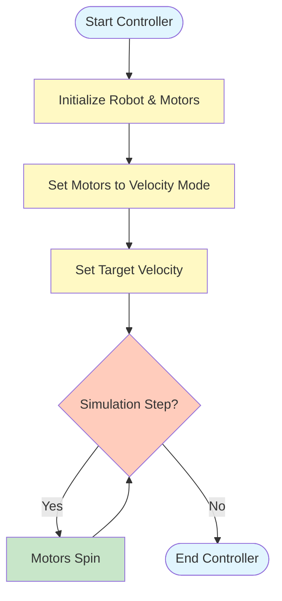
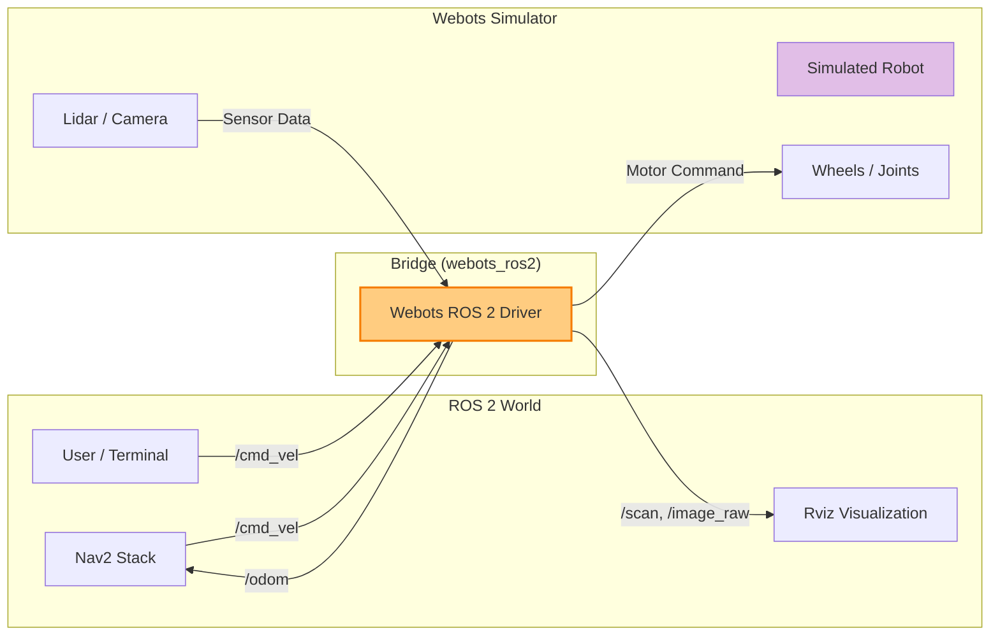

# Chapter 3: Robot Simulation with Webots

> **Learning Objectives**
> - Understand the importance of robot simulation and the "Sim-to-Real" gap.
> - Install and configure **Webots** on Linux and Windows.
> - Create a simple Python controller to move a robot.
> - Integrate Webots with **ROS 2** to publish and subscribe to topics.
> - Compare Webots with Gazebo and understand when to use each.

## 1. Introduction to Robot Simulation

Simulation is the playground of Physical AI. Before we let a 50kg humanoid robot walk in the real world (where it could fall, break, or hurt someone), we teach it to walk in a **simulator**.

### Why Simulate?

1.  **Safety**: A simulated robot can crash 1,000 times without costing a penny. A real robot crashing once can cost thousands of dollars.
2.  **Speed**: Simulations can run faster than real-time. You can train an AI agent for "100 days" of experience in just a few hours.
3.  **Reproducibility**: You can recreate the exact same scenario (e.g., a person walking in front of the robot) every time to test your code.

### The Sim-to-Real Gap

While simulation is powerful, it's not perfect. The difference between how a robot behaves in simulation and the real world is called the **Sim-to-Real Gap**.
- **Physics**: Friction, air resistance, and motor dynamics are hard to model perfectly.
- **Sensors**: Real cameras have noise, blur, and lighting changes that simulations might miss.

> [!NOTE]
> Our goal is to minimize this gap so that code working in Webots works on a real robot with minimal changes.

---

## 2. Getting Started with Webots

We will use **Webots** as our primary simulator. It is open-source, user-friendly, and comes with many pre-built robots (including humanoids like NAO and Boston Dynamics Spot).

### Installation Guide

#### Option A: Linux (Ubuntu 22.04 / 24.04)

The easiest way to install Webots on Ubuntu is using the official Debian package.

1.  **Download the .deb file**:
    Go to the [Webots Releases Page](https://github.com/cyberbotics/webots/releases) and download the latest version (e.g., `webots_2023b_amd64.deb`).

2.  **Install via Terminal**:
    ```bash
    cd ~/Downloads
    sudo apt install ./webots_*.deb
    ```

3.  **Verify Installation**:
    Type `webots` in your terminal. The simulator should launch.

#### Option B: Windows 10 / 11

1.  **Download the Installer**:
    Go to the [Webots Releases Page](https://github.com/cyberbotics/webots/releases) and download the `.exe` installer (e.g., `webots-2023b_setup.exe`).

2.  **Run the Installer**:
    Follow the on-screen instructions. We recommend checking "Add Webots to PATH" if prompted.

3.  **Verify**:
    Open the Start Menu, search for "Webots", and launch it.

> [!IMPORTANT]
> **System Requirements**: Webots requires a decent GPU (NVIDIA recommended) and at least 8GB of RAM. If Webots runs slowly, try lowering the graphical quality in `Tools > Preferences > OpenGL`.

---

## 3. Running Your First World

When you open Webots, you are greeted with a welcome screen. Let's create a new world and add a robot to it.

1.  **Create a New World**:
    - Go to **File > New World**.
    - Select "Empty World" and click **Next** then **Finish**.
    - You will see a checkered floor and a simple background.

2.  **Add a Robot (Pioneer 3-DX)**:
    - Click the **Add** button (➕) on the top toolbar (or press `Ctrl+Shift+A`).
    - In the search bar, type `Pioneer 3-DX`.
    - Navigate to `PROTO nodes (Webots Projects) > robots > adepts > pioneer3 > Pioneer3dx (Robot)`.
    - Click **Add**.

    > [!TIP]
    > The Pioneer 3-DX is a popular two-wheeled mobile robot perfect for learning. It has two drive wheels and a caster wheel for stability.

3.  **Explore the Interface**:
    - **3D Viewport**:
        - **Left Click + Drag**: Rotate the camera.
        - **Right Click + Drag**: Pan (move) the camera.
        - **Scroll Wheel**: Zoom in and out.
    - **Scene Tree (Left Panel)**: This lists everything in your world. You should see `Pioneer3dx` listed here.
    - **Properties (Right Panel)**: When you click on the robot in the Scene Tree, its properties (position, rotation, controller) appear here.

---

## 4. Creating a Simple Robot Controller

A **Controller** is a program (usually Python or C++) that tells the robot what to do. Let's write a simple Python script to make our Pioneer 3-DX move forward.

### Step 1: Create the Controller

1.  In Webots, go to **Wizards > New Robot Controller**.
2.  Click **Next**.
3.  Select **Python** as the language.
4.  Name it `my_first_controller`.
5.  Click **Finish**. Webots will open the text editor with a template.

### Step 2: Write the Code

Replace the template code with this logic to control the Pioneer's motors:

```python
from controller import Robot

# 1. Initialize the Robot
robot = Robot()

# Get the time step of the current world
timestep = int(robot.getBasicTimeStep())

# 2. Initialize Motors
# The Pioneer 3-DX has motors named 'left wheel' and 'right wheel'
left_motor = robot.getDevice('left wheel')
right_motor = robot.getDevice('right wheel')

# 3. Set Motors to "Velocity Mode"
# By setting position to infinity, we tell the motor to spin forever
left_motor.setPosition(float('inf'))
right_motor.setPosition(float('inf'))

# 4. Set Velocity (Speed)
# Speed is in radians per second (rad/s)
left_motor.setVelocity(2.0)
right_motor.setVelocity(2.0)

# 5. Main Simulation Loop
while robot.step(timestep) != -1:
    # The robot will keep moving forward as long as this loop runs
    pass
```

### Visualizing the Controller Logic

Here is how the controller interacts with the robot in a loop:



### Step 3: Attach Controller to Robot

1.  In the **Scene Tree**, find your robot (e.g., `Pioneer3dx`).
2.  Expand it and look for the `controller` field.
3.  Click on the current controller name (or `<generic>`) and select `my_first_controller` from the list.
4.  **Save the world** (File > Save World As...).
5.  **Reset and Run**: Click the Reset button (⏪) and then the Play button (▶).

**Result**: Your robot should move forward!

---

## 5. Integrating Webots with ROS 2

Now comes the real power: connecting Webots to ROS 2. This allows us to use standard ROS tools (like Rviz, Nav2, and our own nodes) to control the simulated robot.

We use the `webots_ros2` package for this.

### Installation

```bash
sudo apt install ros-jazzy-webots-ros2
```

### Launching Webots from ROS 2

Instead of opening Webots manually, we use a ROS 2 launch file. This automatically starts Webots and the necessary bridge nodes.

Create a new launch file `webots_launch.py`:

```python
import os
from launch import LaunchDescription
from launch.actions import IncludeLaunchDescription
from launch.launch_description_sources import PythonLaunchDescriptionSource
from ament_index_python.packages import get_package_share_directory

def generate_launch_description():
    # Find the webots_ros2_driver package
    webots_ros2_driver_pkg = get_package_share_directory('webots_ros2_driver')

    # Include the standard Webots launch file
    webots_launch = IncludeLaunchDescription(
        PythonLaunchDescriptionSource(
            os.path.join(webots_ros2_driver_pkg, 'launch', 'webots_launch.py')
        ),
        launch_arguments={
            'world': 'path/to/your/my_world.wbt', # Replace with your world path
            'mode': 'realtime',
        }.items()
    )

    return LaunchDescription([
        webots_launch
    ])
```

### Controlling via ROS 2 Topics

The `webots_ros2` driver acts as a bridge. It reads data from Webots (Sensors) and publishes it to ROS 2. It also subscribes to ROS 2 commands and sends them to Webots (Motors).



Once the bridge is running, Webots exposes the robot's motors and sensors as ROS 2 topics.

1.  **List Topics**:
    ```bash
    ros2 topic list
    ```
    You should see `/cmd_vel`, `/scan`, `/odom`, etc.

2.  **Move the Robot**:
    Publish a velocity command to `/cmd_vel`:
    ```bash
    ros2 topic pub /cmd_vel geometry_msgs/msg/Twist "{linear: {x: 0.5}, angular: {z: 0.0}}"
    ```
    The robot in Webots should move!

### Writing a ROS 2 Control Node

Instead of using the terminal, let's write a Python script to drive the robot in a circle.

Create a file named `circle_driver.py`:

```python
import rclpy
from rclpy.node import Node
from geometry_msgs.msg import Twist

class CircleDriver(Node):
    def __init__(self):
        super().__init__('circle_driver')
        # Publish to /cmd_vel to control the robot
        self.publisher_ = self.create_publisher(Twist, '/cmd_vel', 10)
        # Timer to publish commands every 0.1 seconds
        self.timer = self.create_timer(0.1, self.timer_callback)
        self.get_logger().info('Circle Driver Started: Driving robot in a circle')

    def timer_callback(self):
        msg = Twist()
        # Linear velocity (forward speed)
        msg.linear.x = 0.5
        # Angular velocity (turning speed)
        msg.angular.z = 0.5
        
        self.publisher_.publish(msg)

def main(args=None):
    rclpy.init(args=args)
    node = CircleDriver()
    try:
        rclpy.spin(node)
    except KeyboardInterrupt:
        pass
    finally:
        # Stop the robot when shutting down
        stop_msg = Twist()
        node.publisher_.publish(stop_msg)
        node.destroy_node()
        rclpy.shutdown()

if __name__ == '__main__':
    main()
```

Run this node while Webots and the bridge are running, and your simulated robot will start driving in circles!

---

## 6. Troubleshooting Common Issues

### 1. "Webots won't start" or crashes
- **Cause**: Often due to GPU driver issues.
- **Fix**: Update your NVIDIA/AMD drivers. On Linux, try launching with `webots --stream="enforce-gl"` to force OpenGL mode.

### 2. "Controller not found"
- **Cause**: The robot's `controller` field doesn't match your script name.
- **Fix**: Check the Scene Tree. Click the robot, find the `controller` field, and ensure it is set to `my_first_controller` (or `<extern>` if using ROS 2).

### 3. ROS 2 Topics are missing
- **Cause**: The `webots_ros2_driver` isn't running or the simulation is paused.
- **Fix**: Ensure you launched the bridge correctly. Check that the simulation is playing (▶ button). Run `ros2 node list` to see if the driver node is active.

---

## 7. Webots vs Gazebo

| Feature | Webots | Gazebo (Classic / Ignition) |
| :--- | :--- | :--- |
| **Ease of Use** | ⭐⭐⭐⭐⭐ High. Easy installer, simple GUI. | ⭐⭐⭐ Medium. Requires more setup. |
| **Built-in Robots** | Huge library (NAO, Spot, DJI drones). | Fewer built-in, relies on community packages. |
| **Physics** | ODE (Fast, stable). | ODE, Bullet, Dart, Simbody (Flexible). |
| **ROS 2 Support** | Good (`webots_ros2`). | Excellent (Native integration). |
| **Best For** | Beginners, Education, Humanoids. | Research, Custom Physics, Complex Environments. |

> [!TIP]
> We use **Webots** in this book because it lets us focus on the *AI and Logic* rather than fighting with simulation configuration.

---

## Chapter Summary

- **Simulation** is critical for safe and fast robot development.
- **Webots** is a user-friendly simulator with excellent ROS 2 support.
- A **Controller** is the brain of the robot in Webots.
- The **`webots_ros2`** package bridges the gap, allowing ROS 2 nodes to control simulated robots.

## Practice Questions

1.  **True or False**: A simulation perfectly replicates the real world with 100% accuracy.
2.  **Code**: What function must be called in the `while` loop to advance the Webots simulation step?
3.  **ROS 2**: Which topic is commonly used to send velocity commands to a mobile robot?

<details>
<summary>Click to reveal answers</summary>

1.  **False**. The "Sim-to-Real Gap" means simulations are approximations.
2.  `robot.step(timestep)`
3.  `/cmd_vel`

</details>
